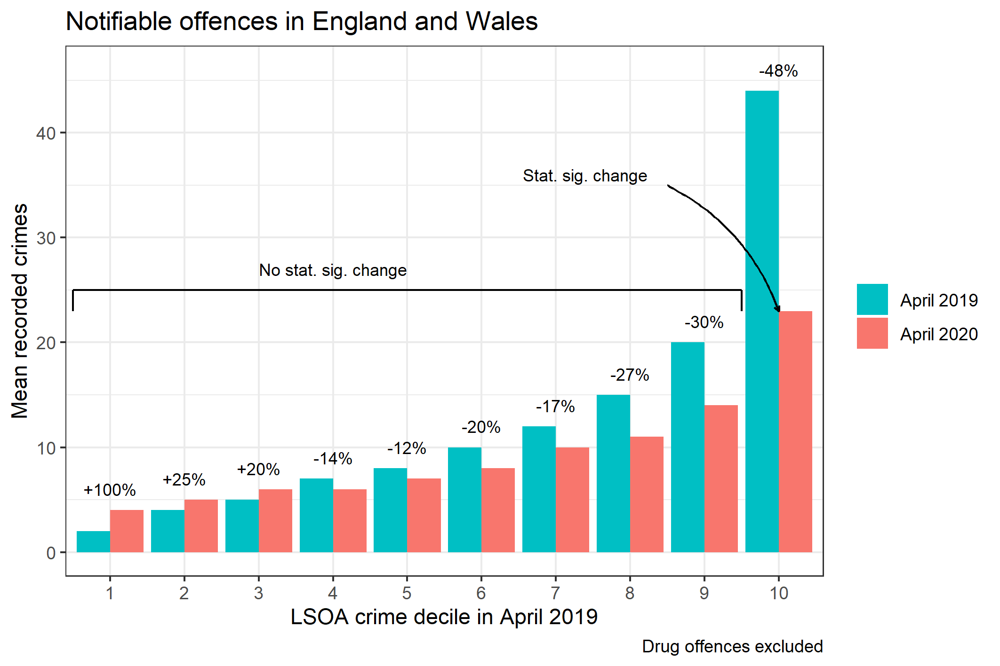
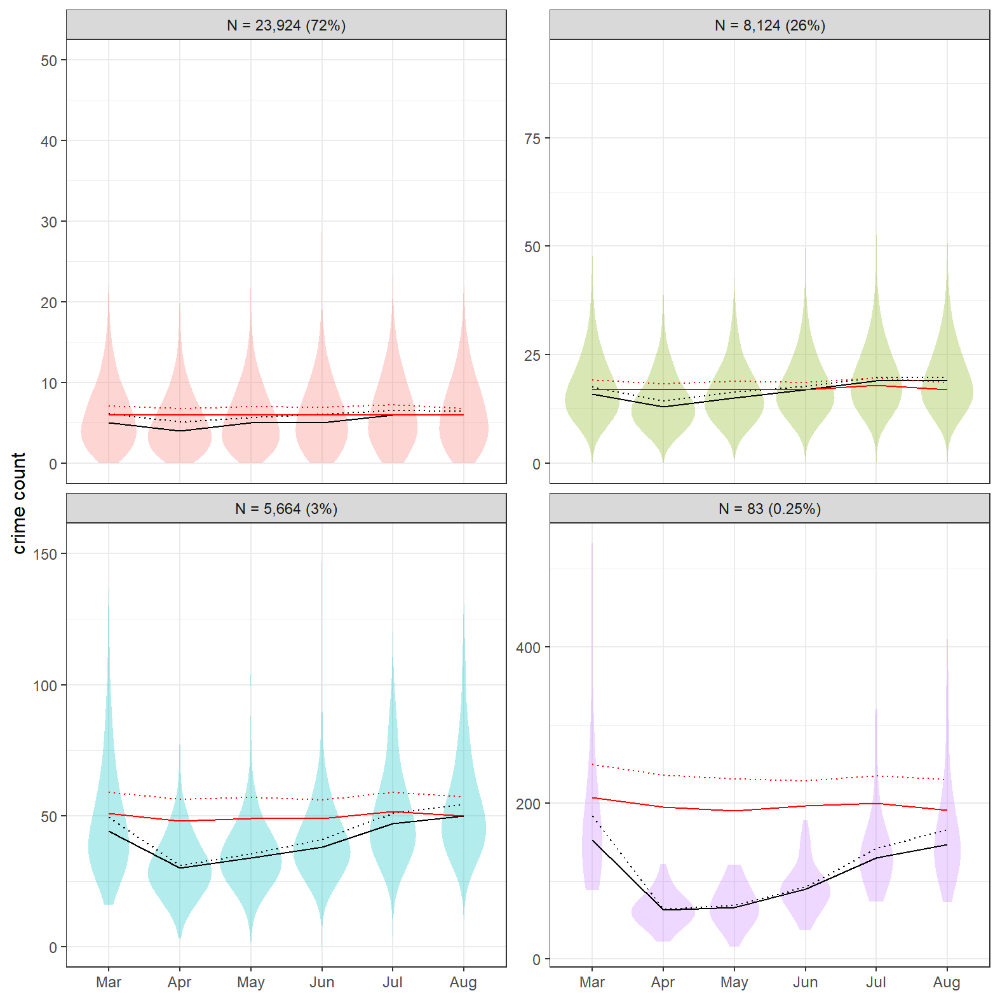
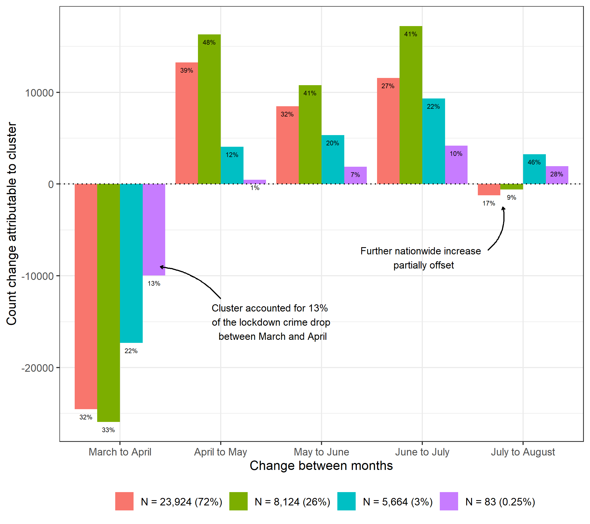
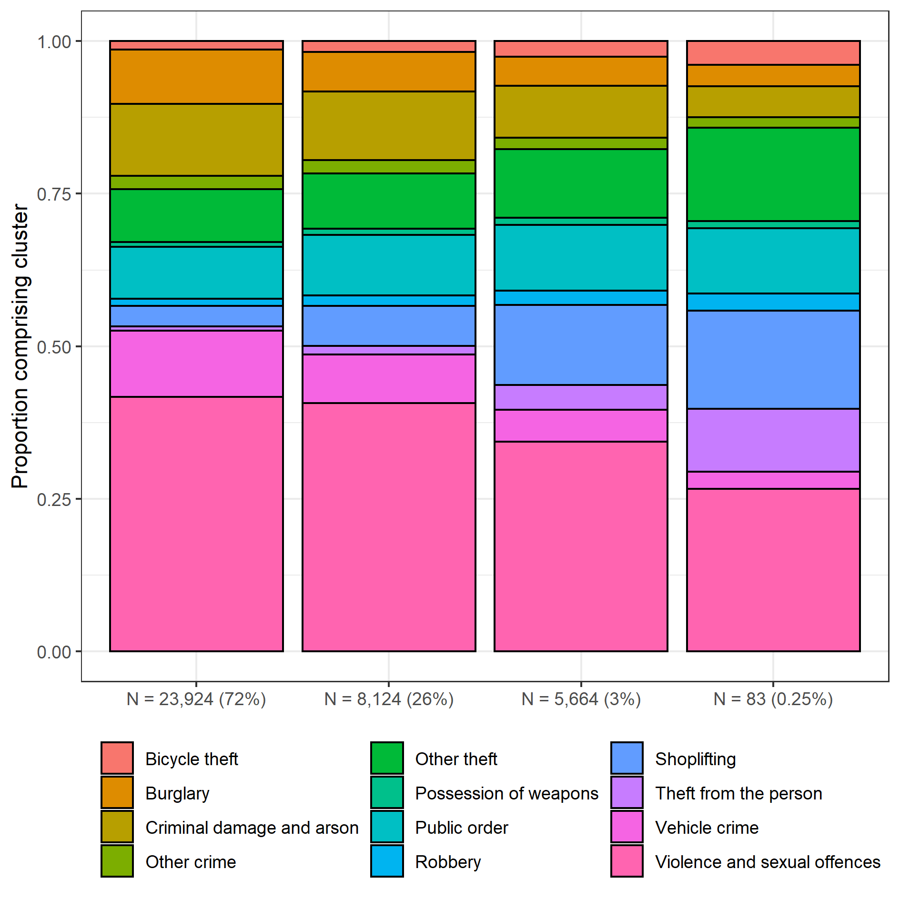
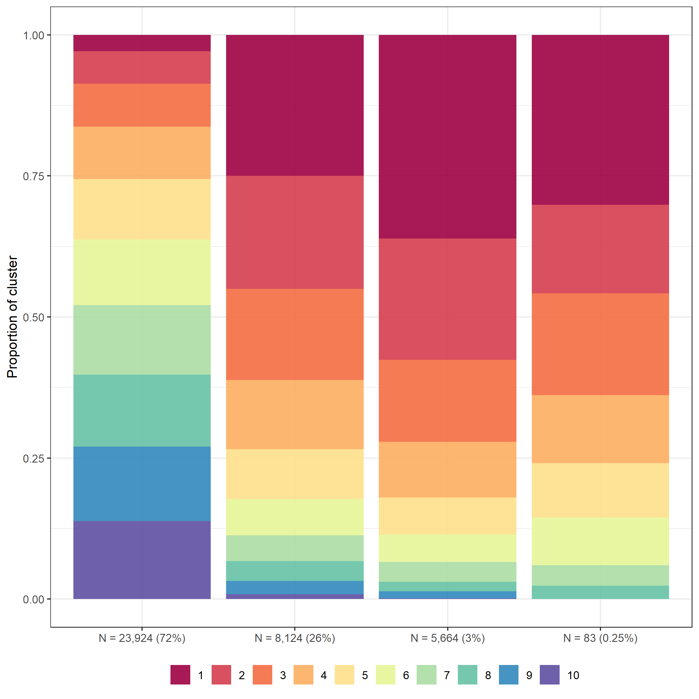
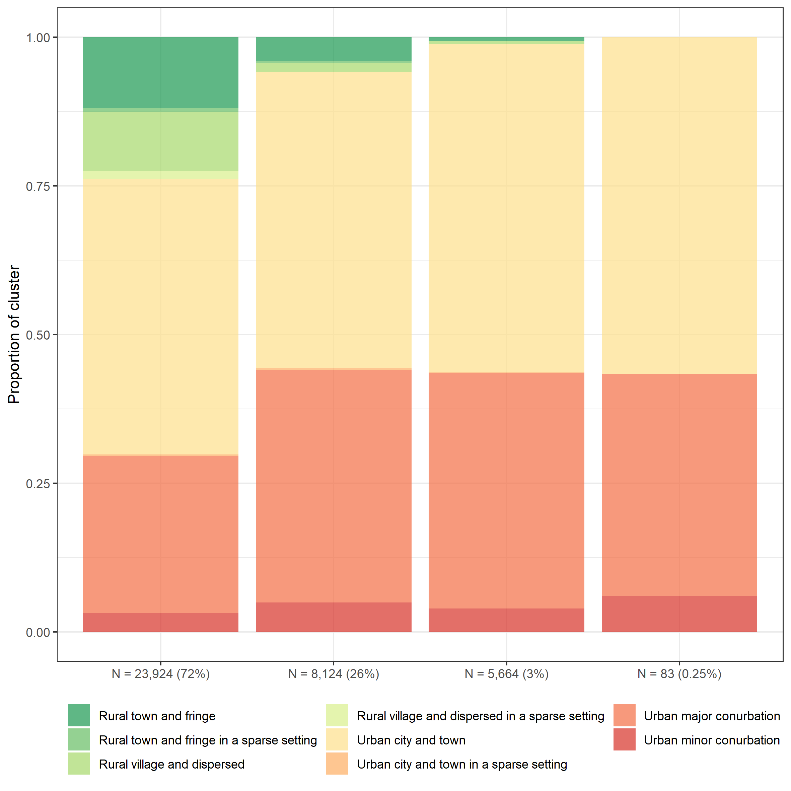

```{r setup, include=FALSE, echo = F}
knitr::opts_chunk$set(echo = FALSE)
```

## Introduction

- An evidence-base has begun to emerge around the impact of the COVID-19 pandemic on crime and anti-social behaviour.
- Findings have tended to demonstrate a widespread decline in police-recorded crime, although the extent to which this holds true varies by crime type.
- But, most studies have focused on macro-level units of analysis, such as cities or countries.
- A recent study took a 'look back' on the first six months of lockdown using police-recorded crime data aggregated to England and Wales.
- The macro-level longitudinal patterns observed were consistent with opportunity perspectives on crime.
- Here, we disentangle this macro-level trend using localized data aggregated to neighbourhood units across England and Wales. 
- We focus on the extent to which localized areas remained stable, or were subject to volatility, amidst the nationwide change in police-recorded crime.
- This includes a descriptive analysis of concentration, an identification of the 'drivers' of the lockdown crime drop, and the characteristics of localized areas driving the change.
- In doing so, we disentangle the macro-level crime trends observed during lockdown in England and Wales.

## Background

- Overview of findings on lockdown crime to date.
- Note that a key missing component relates to spatial concentrations, and the extent to which macro-level trends mask underlying, localized variation.
- These discussions have proved vital to crime and place research, and our understanding of criminal opportunity and routine activities theory (e.g. law of crime concentration).
- Localized analysis may also shed light on policing and resource allocation during lockdown.
- In England and Wales, we already have a reasonable understanding of the macro-level trends.

```{r crimeoverall, fig.pos = 'H', message=F, comment=F, warning=F, fig.cap = "Macro-level crime trends in England and Wales during the lockdown period in 2020."}
knitr::include_graphics("visuals/raw_counts_gg.png")
```

## Data and Method

- Generalized Gini coefficient for all offence categories.
- Focus on two broad categories: notifiable offences and anti-social behaviour (ASB).
- Decile change to establish whether previously high-crime/ASB areas remained, ceased or became increasingly problematic during lockdown.
- Non-parametric longitudinal clustering (k-means) used to disentangle the macro-level trends observed during the lockdown, and identify the 'drivers' of the dramatic drop and subsequent resurgence.
- This speaks to existing literature and methods deployed in crime and place research. 

## Results

### Gini 

```{r crimegini, fig.pos = 'H', message=F, comment=F, warning=F, fig.cap = "Measure of concentration using the generalized Gini coefficient during the lockdown period."}
knitr::include_graphics("visuals/gini_gg.png")
```

### Deciles

```{r decilenotoff, fig.pos = 'H', message=F, comment=F, warning=F, fig.cap = "Decile changes in notifiable offences."}

```

### Longitudinal clustering

#### Cluster trends

- General conclusion: most of the lockdown crime drop can be attributed to a small number LSOAs.
- Most localized areas actually experienced minimal crime change during the pandemic.
- The proportion of total crime attributable to very low and very high crime clusters fell into April, while mid-crime areas increased their proportion.
- All clusters converged back to 'normality' by the end of August.
- Remarkable stability given the absolute change that occurred during this study period.
- 2020 mean (dotted line) and median (solid line) of each cluster are shown in black.
- 2019 mean (dotted line) and median (solid line) of each cluster are shown in red.
- This demonstrates that the clusters identified using the 2020 data were distinct and meaningful even when also applied to the 2019 data.

```{r kmeansnotoff, fig.pos = 'H', message=F, comment=F, warning=F, fig.cap = "K-means cluster solutions for LSOA notifiable offences. Mean (dotted line) and median (solid line) are shown for each cluster for 2020 (black) and 2019 (red) respectively. Violin plots refer to 2020 only.", out.width= "90%"}

```

#### Contribution of each cluster to change

```{r changeline, fig.pos = 'H', message=F, comment=F, warning=F, fig.cap = "Proportion of month-on-month change in crime attributable to each cluster", out.width= "90%"}

```

- The above summarises the proportion of month-to-month change in crime counts attributable to each cluster.
- In other words, we try and use this to identify which clusters drove the initial decline and subsequent resurgence nationwide.
- For example, the red cluster (N = 23,924), despite consisting of 72% of total LSOAs, contributed to around 30% of the drop in notifiable offences between March and April.
- While, the pink cluster (N = 83) despite comprising only 0.25% of LSOAs, contributed to 12.5% of the fall in notifiable offences between March and April.
- July to August is weird, because although total crime increased slightly between those months, counts actually decreased for the red and green groupings, and increased for blue and purple. So, the blue and purple groupings drove this final nationwide increase on their own, countering the decline observed in red and green LSOAs. I think this is why the proportional figures do not add up to 1 for this final monthly change, so I need to think of a better way of summarizing this.
- I haven't worked out how to visualize things yet - it needs revisiting, but hopefully gives you an idea.

### Spatial distribution of clusters

- List major city composition?
- Maps of major city case studies.

### Characteristics of clusters

Descriptive statistics about the LSOAs in each cluster solution.

#### Crime type profile

- What crime types tend to comprise each cluster?

```{r crimeprofile, fig.pos = 'H', message=F, comment=F, warning=F, fig.cap = "Crime type characteristics of each cluster solution.", out.width= "90%"}

```

### Deprivation

- What is the level of deprivation across each cluster?
- Note that deciles for England and Wales have been allocated separately, because they have a different IMD measure.

```{r deprivclus, fig.pos = 'H', message=F, comment=F, warning=F, fig.cap = "Deprivation decile distribution of each cluster solution.", out.width= "90%"}

```

#### Urban-rural distinction

- What is the urban-rural distinction of each cluster?

```{r urbanrural, fig.pos = 'H', message=F, comment=F, warning=F, fig.cap = "Urban-rural classification distribution of each cluster solution.", out.width= "90%"}

```

## Discussion
