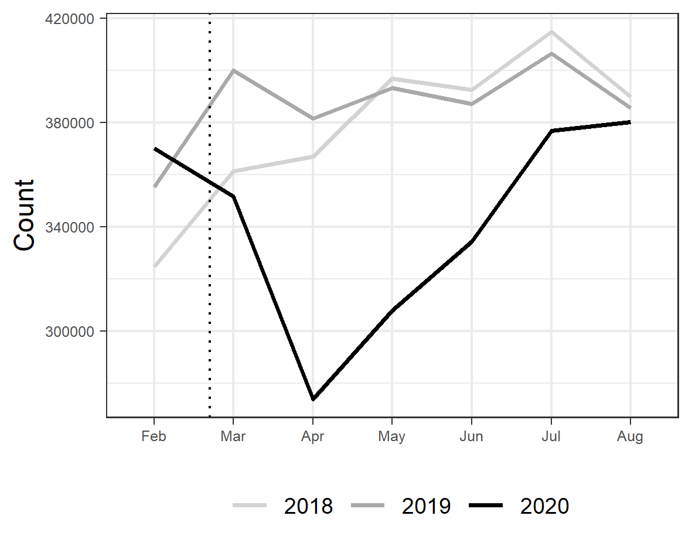
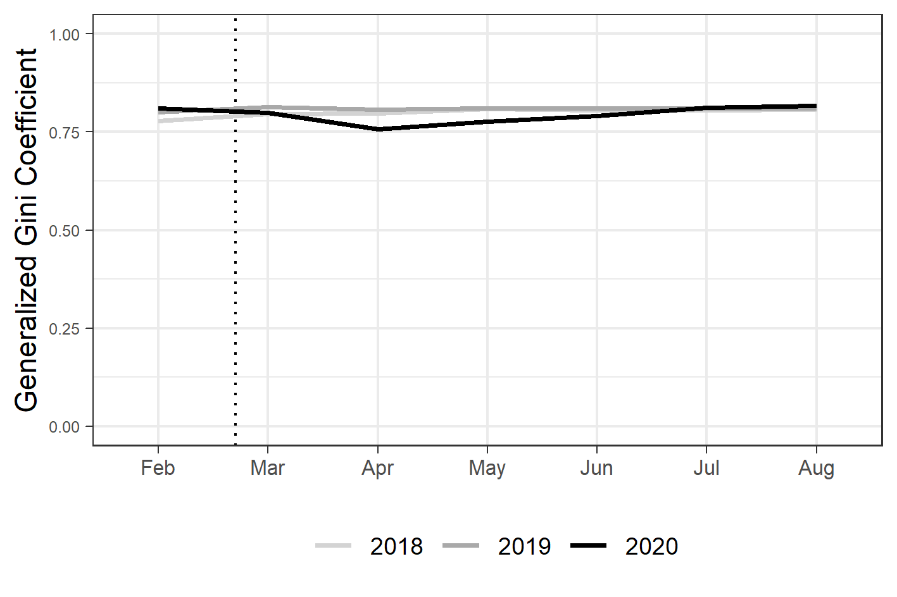
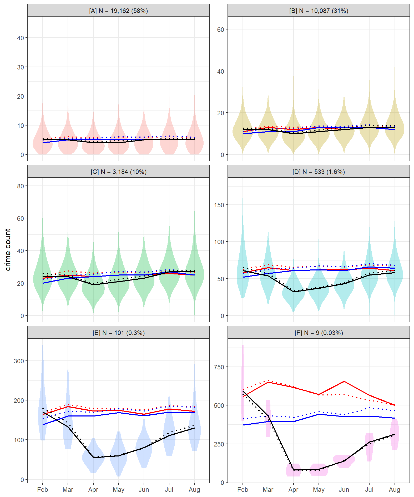
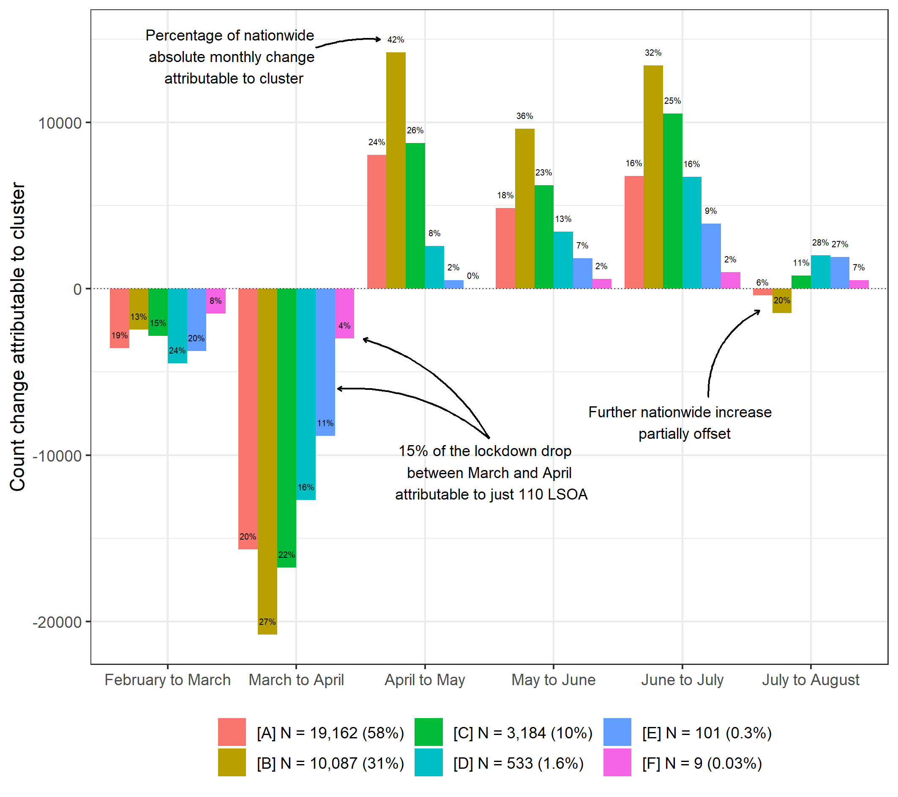
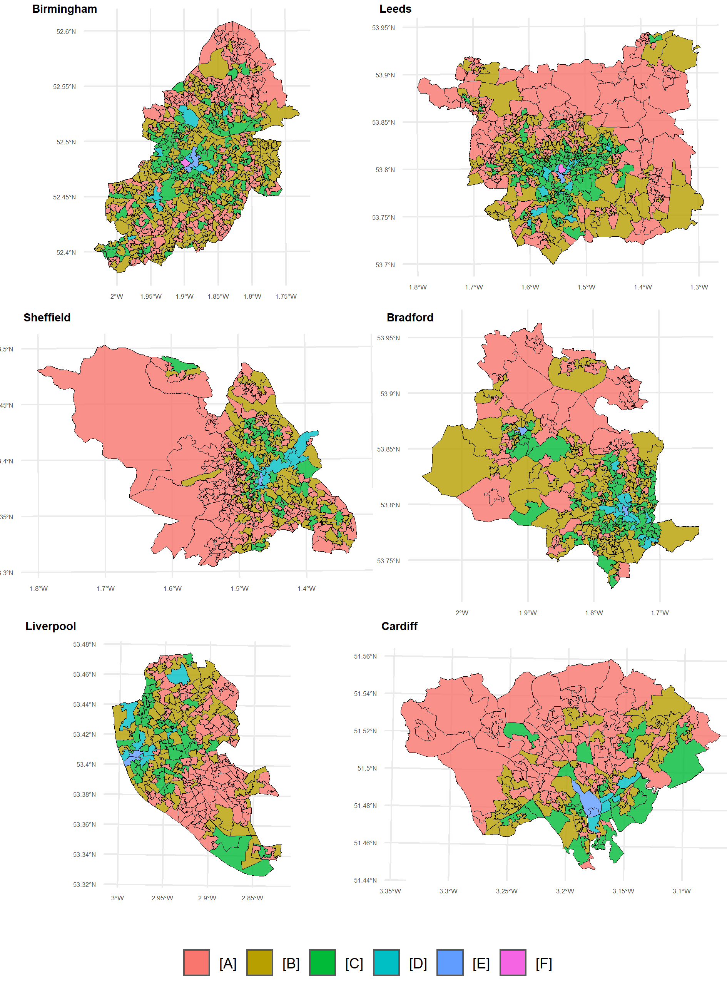
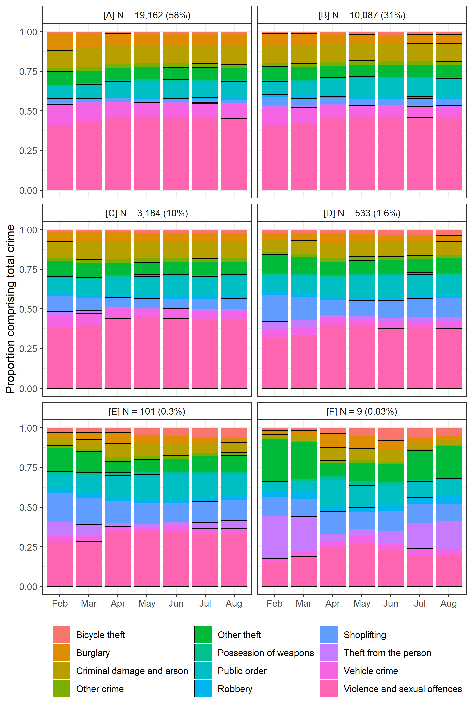
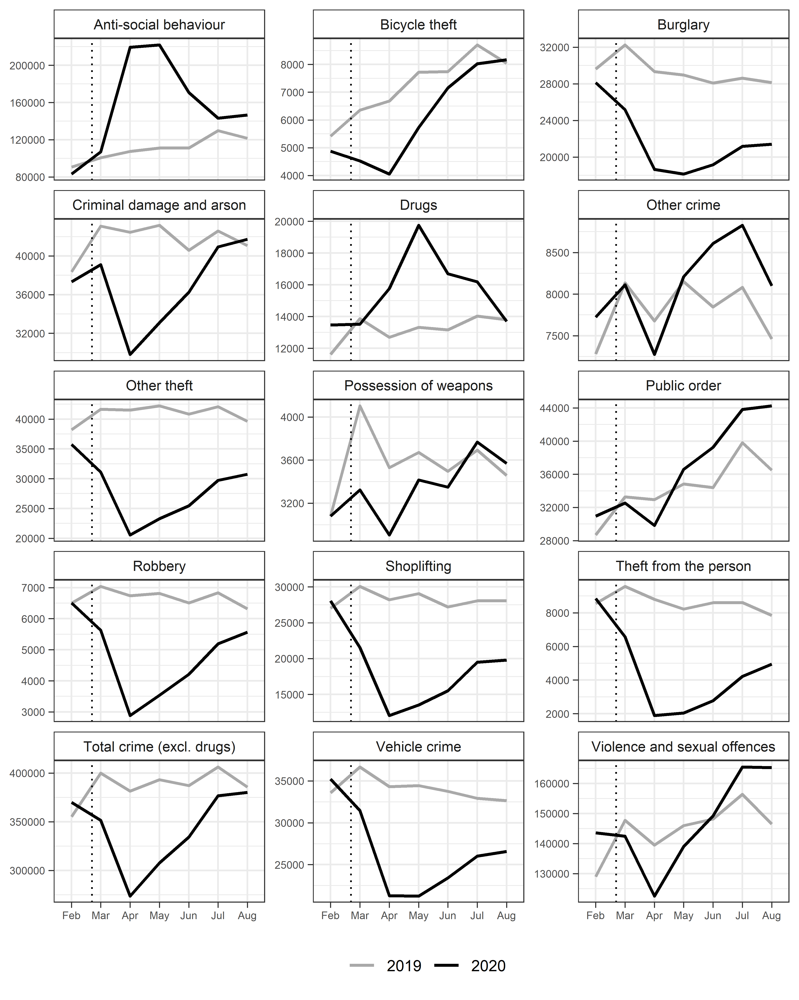
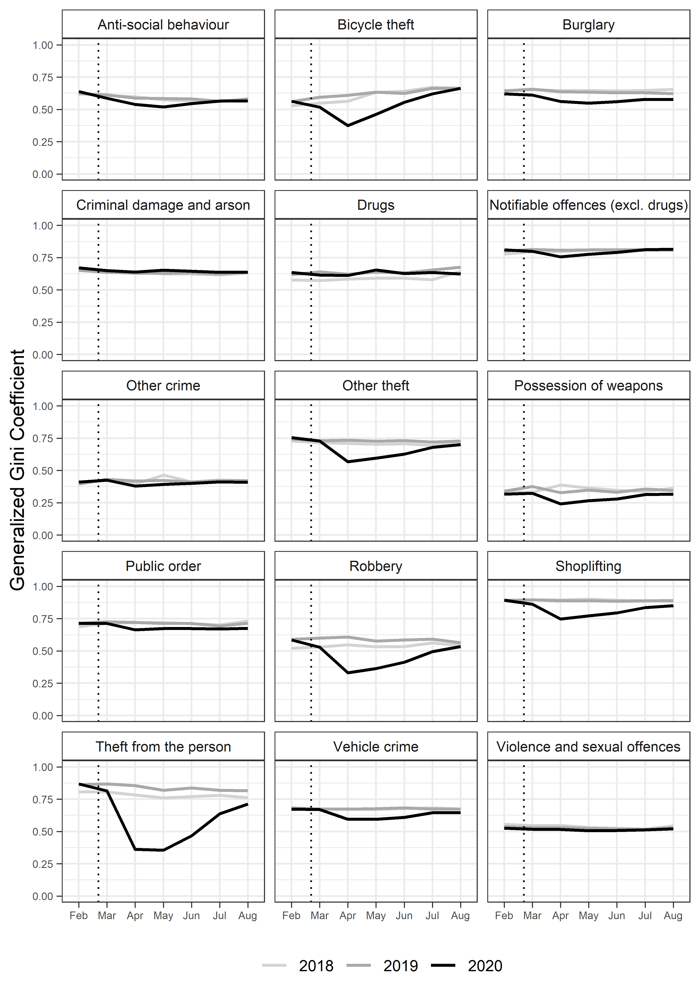
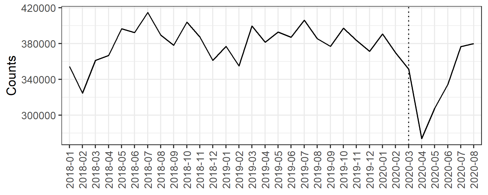

```{r setup, include=FALSE, echo = F}
knitr::opts_chunk$set(echo = FALSE)
library(readr);library(kableExtra)
```

# Introduction

Efforts to slow the spread of COVID-19 through social distancing and restrictions on citizen mobility have induced dramatic and unprecedented changes in police-recorded crime. Studies from international case study sites including the United States, United Kingdom and Australia have reported a decline in most crime types following the imposition of "stay at home" (or equivalent) orders [@estevez2020crime]. Generally speaking, findings have aligned with expectations from opportunity perspectives on crime. Lockdown mobility patterns disrupted the typical convergence of motivated offenders, suitable targets and capable guardians, reducing opportunities for victimization [@stickle2020crime]. As lockdown restrictions were slowly repealed, routine activities converged back to pre-pandemic levels and we witnessed a resurgence in criminal activity [@langton2021cs].

While existing studies have provided insight into the opportunity structures of crime, and the nuances of using police data to study lockdown as a natural experiment [@stickle2020crime; @langton2021cs] research has almost exclusively been undertaken using macro-level units of analysis, such as cities or countries. Less is known about the localized drivers of the lockdown crime drop or the degree to which macro-level trends are masking geographic inequalities in victimization. Pre-pandemic research examining the (in)stability of crime at fine-grained spatial scales [@weisburd2012criminology; @curman2015crime] and inequalities in the crime drop [@mcvie2020increasing; @ignatans2016whom; @akmed2021mon] would certainly suggest that local areas are unlikely to have experienced the macro-level lockdown crime trends in unison. Rather, we might expect specific places, typically associated with high ambient populations and plentiful opportunities for crime, to have driven the wider trend, with most localized areas remaining fairly stable.

Examining the localized drivers of the lockdown crime drop represents the primary motivation of this paper. We disentangle the macro-level drop in police-recorded crime observed in England and Wales between February and August 2020. We deploy non-parametric longitudinal clustering to identify clusters of meso-level units which contributed disproportionately to the nationwide drop and subsequent resurgence in crime during the nationwide lockdown. The spatial patterning, opportunity structure and crime type profile of these local areas are quantified and summarized for their consistency with expectations for opportunity and mobility theories of crime [@halford2020crime].

# Background

- Recent months have seen a wave of interest in describing and explaining changes in  police-recorded crime in response to restrictions on mobility brought about by efforts to limit the spread of COVID-19.
- Generally speaking, findings have been consistent with theoretical expectations from an opportunity perspective, namely, that lockdown restrictions disrupted the convergence of motivated offenders, (in)capable guardians and suitable targets, bringing about widespread, macro-level declines in crime.
- Some notable cases demonstrate that changes may be specific to crime type, although some studies using longer time periods have shown that change has been relatively uniform across crime types, with some exceptions (Langton et al., 2021).
- Findings hold important practical and theoretical value for crime science research, and yet, less is known about the localized drivers of macro-level trends. 
- Questions around the drivers of macro-level crime drops have been of interest for some time, following the widespread fall in crime since the 1990s [@farrell2014crime; @weisburd2012criminology; @weisburd2004trajectories; @bannister2018local].
- At the city level, numerous studies have deployed longitudinal clustering methods to unmask localized variation in the crime drop. Findings have consistently found that macro-level declines in crime over many years (decades) tend to be driven by a disproportionately small number of places, with most areas remaining fairly stable.
- Here, we are presented with a unique scenario. Rather than a gradual decline in police-recorded crime over many decades, we have witnessed a rapid decline over a matter of weeks and months. And yet, comparable questions remain.
- To what extent have local areas experienced this decline in unison?
- Can we attribute most of the macro-level count trends to a handful of meso-level areas? 
- Have the dividends of the lockdown crime drop been shared equitably across space [@akmed2021mon]?
- Here, we use 7-months of police-recorded crime in England and Wales, aggregated to meso-level local units, to disentangle the nationwide lockdown crime drop.
- We describe areas in terms of their opportunity structure, spatial patterning and crime type profile.

# Data and Method

To examine localized instability in the lockdown crime drop, we make use of three data sources, namely, open police-recorded crime data, geographic boundaries from Ordnance Survey and the Office for National Statistics (ONS), and data sourced from the Open Street Map API. Each of these are now outlined in turn, followed by an outline of the methods deployed. Code to replicate the data downloads, handling, analyses and visualization reported here is openly available (https://github.com/langtonhugh/covid_spatial). 

## Crime data

Open police-recorded data on crime and anti-social behavior in England and Wales is published through an online web portal (https://data.police.uk/). Individual records are released on a month-by-month basis for each of the 43 police forces comprising England and Wales. We used a study period spanning February to August 2020 in order to capture the first six months of the nationwide lockdown (March to August) and the one month preceding the change (February). For reference and comparison to historical trends, we obtained data for the same months in 2018 and 2019. Individual records are time-stamped by month -- the temporal scale of this study. Due to ongoing data issues with Greater Manchester Police, we excluded data from this region, and therefore collated data from 42 out of 43 forces in England and Wales.

Individual open records categorize crime according to thirteen different notifiable offence categories (e.g. burglary, violence and sexual offences, theft from the person, vehicle crime).^[Further information on these crime categories can be obtained from https://www.police.uk/pu/contact-the-police/what-and-how-to-report/what-report/.] Records also include anti-social behaviour (ASB) which usually captures less serious offences such as nuisance behavior and is not a notifiable offence. Individual records were aggregated to create a count measure for notifiable offences (excluding drugs) by month either at the nationwide (macro) level, or the localized (meso) level, as detailed in the next section. There widespread recognition that drug crime trends, particularly during the COVID-19 lockdown, largely reflect policing proactivity rather than meaningful shifts in criminal behavior [@langton2021cs]. Recognizing that aggregating data across crime types can mask variation [@andresen2017trajectories] we later decompose our main findings according to the twelve remaining notifiable offences, and refer to additional analyses in the Appendix.

## Unit of analysis

For nationwide (macro) descriptive statistics, which set the background for the main analyses, we use the geographic region of England and Wales, noting the exclusion of Greater Manchester. For localized (meso) analysis, we aggregate offences to Lower Super Output Area (LSOA). LSOA are a meso-level geographic units designed for the reporting of official statistics at small geographies [@onslsoa]. England and Wales is comprised of 32,844 LSOA designed to be uniform by resident population size. In 2019, LSOA housed an average of 1,700 people. Data obtained from the open police data portal (see previous section) includes a pre-assigned field stating the LSOA in which the crime occurred, as recorded by the police. Due to the spatial anonymization method used prior to data release, LSOA are the lowest level of aggregation at which we can reasonably assume spatial accuracy across multiple crime types [@tompson2015uk]. Boundaries reflect 'on the ground' characteristics such as roads and railways [@onslsoachange], and as such, we consider LSOA to represent meaningful behavioral spaces to study the opportunity structures of crime. After removing crimes recorded by Greater Manchester Police, crimes recorded to have occurred within the Greater Manchester region, and four LSOAs which contained no crime between 2018 and 2020 (likely due to the spatial anonymization process), our final sample population for the meso-level analysis comprised 33,075 LSOA.

## Open Street Map

To summarize the opportunity structure of local areas we required a nationwide dataset of theoretically relevant facilities and urban features which could be aggregated at the LSOA level. To this end, we obtained point-level data from the Application Programming Interface (API) for Open Street Map via the `osmdata` package [@padgham2017osmdata] in `R` [@team2013r]. Open Street Map is a crowdsourced geospatial database containing a vast array of features which can be used for explaining the temporal and spatial patterning of crime [@langton2020open]. Geographic features are identified by pairs of keys and values which can be used to computationally query the API for data. Based on existing research examining the opportunity structures of fine-grained spatial scales, we collated the coordinate locations of the following facilities:

- Nightlife: pubs, nightclubs, restaurants.
- Shops: convenience stores, malls, shoe shops, department stores, clothes shops, electrical shops, supermarkets, chemists, greengrocers.
- Public transport: bus stops and railway stations.
- Bicycle parking: bicycle parking lots.

The point-level data on these features were aggregated to create counts for each facility by LSOA. For simplicity, and due to issues of data sparsity, we sum the counts for each facility according to their overarching description (i.e. nightlife, shops, public transport, bicycle parking). We hypothesize that LSOAs containing a high number of facility counts across each domain will have higher pre-pandemic levels of crime, due to the plentiful opportunities for criminality, and in turn, steeper declines in crime following lockdown due to such opportunities suddenly becoming unavailable. We expect areas with _low_ counts across these domains to have similarly low crime levels pre-lockdown, and thus will remain low and stable following lockdown commencement.

# Method 

Analyses to examine the localized variation in the lockdown crime drop are conducted in three principal stages. First, an overview of nationwide (macro) trend is provided in terms of both absolute counts and the degree of concentration. Second, the macro-level trend is disentangled using non-parametric clustering techniques on the LSOA (meso) units (N = 33,075). Third, the characteristics of each cluster will be summarized in terms of their opportunity structures, spatial patterning and crime type profile.

## Macro-level descriptives

Macro-level descriptives of count trends and concentration for notifiable offences (excluding drugs) are reported for provide context from which we will subsequently unmask local (meso) variation. First, we visualize observed counts between February and August 2020 relative to the same periods in 2018 and 2019. In doing so, we can observe how nationwide crime trends changed in the face of lockdown measures [see also @langton2021cs]. Second, we visualize generalized Gini coefficients [@bernasco2017more] to describe the degree of which offences became more (or less) concentrated during lockdown at LSOA level. Again, we report figures for 2018 and 2019 as a point of reference. We use the generalized version of the Gini coefficient to account for data sparsity, as for some crime types reported in the Appendix, the number of crimes falls below the number of LSOAs in the study region. Measures of counts and concentration set scene from which we can disentangle the underlying, meso-level variation.

## Meso-level clustering 

To quantify the degree of meso-level uniformity underpinning the macro-level trend, and identify the potential drivers of the lockdown crime drop, we deploy a longitudinal variant of k-means clustering [@genolini2011kml; @genolini2015kml]. This non-parametric clustering technique has an established role in crime and place research for examining the longitudinal trajectories of local areas in a macro-level crime drop scenario [@curman2015crime; @andresen2017trajectories].

Here, we note that the experimental conditions of the COVID-19 lockdown make the usage of k-means particularly suitable. Existing research adopting the method has tended to investigate _long-term_ change over years or decades, focusing on the directional homogeneity (e.g. increasing, decreasing or stable) of clusters, rather than short-term volatility [@andresen2017trajectories]. And yet, one key strength of k-means is that it is capable of identifying short-term fluctuation in longitudinal trends [@akmed2021mon]. In this lockdown scenario, the availability of criminal opportunities were withdrawn quite literally overnight, and thus we might expect a similarly rapid and short-term change in crime at fine-grained spatial scales. This sets k-means apart from equivalent model-based methods restricted by polynomial terms, such as group-based trajectory modelling [@weisburd2004trajectories] and non-parametric techniques designed for long-term rather than short-term change [@akmed2021mon].

We deploy k-means using the `kml` package [@kmlpack] in R on notifiable offences (excluding drugs) counts for LSOA in the study region (N = 33,075) between February and August 2020. To achieve a parsimonious cluster solution while minimizing the risk of missing underlying variation, we proposed potential solutions between two and eight clusters respectively, choosing the final solution based on the Calinski-Criterion [@calinski1974dendrite]. For each potential solution, twenty redraws with different starting conditions were run to ensure that solutions were stable (see Appendix). 

We visualize the final cluster solution in a manner which conveys the underlying distribution of observations comprising each cluster at each time point, rather than reporting a summary statistic (e.g. the mean trajectory) in isolation, as has been in the case in existing research. For each cluster, we also overlay the equivalent trajectories for 2018 and 2019 as a reference point for comparison to a 'typical' year. In doing so, we aim to not only identify localized (in)stability in the lockdown crime drop, but also assess the extent to which the trends observed have deviated from previous years.

## Cluster characteristics

We expect that the meso-level areas driving the lockdown crime drop will be those with plentiful opportunities for crime. That is, a disproportionately large volume of the decline (and subsequent resurgence) will be attributable to a handful of places which had pre-existing high crime levels as a result of their opportunity structure. Using the measures for opportunity generated from Open Street Map (i.e. nightlife, shops, public transport and bicycle parking), we report descriptive statistics on facility counts for each of the clusters obtained from the k-means analysis. In doing so, we expect to unpick a meaningful pattern which is consistent with the opportunity perspective of crime.

To supplement this, we visualize the spatial patterning of the cluster solutions. For brevity and simplicity, we focus on Birmingham, Liverpool, Leeds, Bradford, Sheffield and Cardiff. We have excluded Greater Manchester due to the lack of police data, and given its size, we determined Greater London to warrant an individual case study for future research. Given these exclusions, the six cities we report represent the five most populous cities in England, and the most populous city in Wales. Study regions are defined by based on the city names appearing in LSOA name.

Finally, recognizing the unique opportunity structure of specific crimes, we summarize the crime type profile of clusters. For each cluster, we report the percentage breakdown of crimes types. We suspect that clusters will have differing crime type profiles according to the opportunity structures of each grouping.

# Results

## Nationwide trends

To set the context for the localized analysis, Figure 2 visualizes crime counts between February and August 2020 for notifiable offences excluding drugs before and after lockdown. This descriptive analysis broadly confirms what has been demonstrated using model-based forecasting analyses elsewhere (Langton et al., 2021) although we note that this descriptive comparison does not account for long-term trends. In April, the first full month of lockdown in England and Wales, we observe a nationwide decline in notifiable offences in comparison to previous years. Upon the relaxation of lockdown rules, crime resurged back to normality, and by August, crime had returned to within a range we might have expected without the nationwide lockdown. This trend represents the 'global' trend which we will subsequently disentangle using localized analyses.

```{r nocounts, fig.pos = 'H', message=F, comment=F, warning=F, fig.cap = "Notitifable offence (excluding drugs) counts in England and Wales during the lockdown period.", fig.align='center'}

```

Figure 3 visualizes the overall level of concentration before and after lockdown, and in comparison to previous years, using the generalized Gini coefficient. Here, it is clear that notifiable offences, even amidst volatile and sharply changing levels in absolute counts (see Figure 2), experienced remarkably stable levels of concentration. There is a marginal dip in concentration during April, the first month of lockdown. This suggests that as crimes fell, those were occurring were _less_ concentrated. That is, crimes occurring during the height of lockdown were more spread out that we might have otherwise expected. That said, concentration quickly returned to normal levels.

```{r nogini, fig.pos = 'H', message=F, comment=F, warning=F, fig.cap = "Monthly generalized Gini cofficient trends for notitifable offences (excluding drugs) in England and Wales during the lockdown period.", fig.align='center'}

```

Based on the dramatic decline and subsequent resurgence of notifiable offences during the study period, we might expect some localized variability. Measures of concentration indicate that there has been stability at the 'global' level, but the evidence-base surrounding the law of crime concentration and micro-place (in)stability would certainly give reason to suspect that this masks underlying volatility [@weisburd2015law; @andresen2017trajectories]. With this in mind, we now report the localized, meso-level analysis which unpicks the macro-level trend.

## Longitudinal clustering

### Cluster trends

We deploy non-parametric k-means clustering on LSOA (meso) level geographic units (N = 33,075) comprising England and Wales to decompose the macro-level 'decline and resurgence' observed between February and August, 2020. Figure 3 visualizes the resulting 6-cluster solution determined by the optimal Calinski-Criterion statistic [@calinski1974dendrite]. Solid black lines represent the median count for each cluster at any given time point, with the black dotted line showing the mean. Violin plots have been added to convey variation around these points at each time point. These suggest that the mean and median point statistics summarize the underlying data reasonably well, and indicate that clusters are distinct from one another, with little overlap. Additional lines have been added to convey each clusters' mean and median trend in 2018 and 2019 respectively. These trends suggest that the clusters identified using the 2020 study period were distinct and meaningful even in previous years, and provide a relative baseline from which we can compare lockdown trends.

Overall, we note that most LSOA were remarkably stable during the pandemic. Clusters A and B could be described and 'low crime and stable', exhibiting fairly low counts throughout the study period and across years. Together, these clusters comprise 89% of LSOA in England and Wales. Even amidst the stark macro-level decline in notifiable offences (see Figure 2) LSOA in these clusters only experienced marginal average dips in crime. The third largest cluster, cluster C, comprises 10% of LSOA in England and Wales. LSOA in this cluster experienced a more prominent dip in crime, along with cluster D (1.6% of LSOA). Together, we might describe these LSOAs as 'mid-crime, mid-drop'. In both cases, there is a clear deviation from previous years. Notifiable offences fall between March and April, and then began to converge back to levels observed in previous years.

```{r kmeansnotoff, fig.pos = 'H', message=F, comment=F, warning=F, fig.cap = "K-means cluster solutions for LSOA notifiable offences (excluding drugs). Distributions refer to 2020 only.", out.width= "90%", fig.align='center'}

```

That said, most 'action' appears to be occurring amongst a small subset of LSOA. Clusters E and F collectively comprise only 0.33% (N = 110) of LSOA in England and Wales. Yet, their crime counts are much higher, and the decline between March and April is considerable. We might therefore describe these clusters as 'high crime, major drop': LSOA with plentiful opportunities for crime in typical times, and in turn, LSOA which are most sensitive to the restriction in opportunities which followed after the imposition of lockdown. Interestingly, clusters E and F represent the only clusters which remained below pre-pandemic levels by August. In both cases, the average counts in February 2020 were _higher_ than those observed in previous years, but following the sharp decline and subsequent increase by August, these averages were _lower_ than 2018 and 2019.

### Contribution of each cluster

To further unpick the contribution of these clusters to the nationwide lockdown crime drop, Figure 4 plots the month-by-month change in counts. Alongside these raw counts, we also include the percentage of total absolute change (i.e. positive or negative) attributable to each cluster. We can use this visual to identify which clusters drove the initial decline and subsequent resurgence nationwide.

As expected, the vast majority of change across all clusters occurred between March and April. Between these months, notifiable offences experienced a dramatic fall nationwide. That said, the figure demonstrates that this decline did not occur equitably across local areas. Consistent with the cluster solutions trends in Figure 3, a small number of LSOA (meso) units appear to have contributed disproportionately to the nationwide (macro) trend. For instance, clusters A and B, which comprise 58% and 31% of LSOA in the country, accounted for only 20% and 27% of the total decline between March and April. By contrast, clusters E and F, which together comprised only 0.33% of LSOA (N = 110) contributed to 15% of the nationwide drop in these months. Again, this suggests that most areas remarkably stable, given the nationwide volatility, with just a handful of areas driving the decline the nationwide lockdown crime drop.

This picture shifts slightly upon the beginning of the resurgence between April and May. Clusters A and B continue to contribute a disproportionately _small_ amount to nationwide change, but the proportion increases, with each contributing 24% and 42% to the increase respectively. The contribution of the smallest clusters E and F is small compared to the initial decline, 2% and 0% (when rounded), respectively. This can be largely attributed to the flattening of their crime count trends between these months. In other words, following their initially steep decline between March and April, crime remained reasonably unchanged between April and May in the 'high crime, major drop' areas.

Following the period of stabilization, clusters E and F gather pace during the resurgence, as does cluster D. For instance, between June and July, these three clusters collectively account for 27% of the nationwide increase, despite comprising less than 2% of LSOA in the country. July to August represents an interesting period. Until that point, each cluster, despite their vastly differing relative contributions to change, were directionally homogeneous. In other words, every cluster declined between February and April, and then increased between April and July. Between July and August, clusters began to diverge. Nationwide, there was a marginal increase in notifiable offence counts (see Figure 1), but this clearly masks a great deal of localized variability.

The 'low crime and stable' clusters (A and B) actually _declined again_ between July and August, and the higher crime clusters continued to increase. The change is almost imperceptible when viewing average counts in these LSOA (see Figure 3) but the sheer size of these units, collectively comprising 89% of England and Wales, has a major impact on nationwide trends. This is suggestive of highly localized change in opportunities as lockdown rules were relaxed: change which is aggregated away at the macro-level. Stable, low crime areas mitigated against further nationwide increases which may, if they had continued, actually resulted in a higher crime count in August than observed in previous years.

```{r changeline, fig.pos = 'H', message=F, comment=F, warning=F, fig.cap = "Counts and percentage of nationwide change between months attributable to each cluster.", out.width= "100%", fig.align='center'}

```

## Characteristics of clusters

### Spatial distribution

The provide local context to the cluster solutions identified through the k-means clustering, we visualize the spatial patterning of groupings for six major cities in England and Wales (see Figure 5). We find distinct geographic pattern to the clusters identified. Here, it is worth noting that the Bradford region contains the city of Bradford, but also the satellite town of Keighley to the north west. The cluster map thus reflects these two urban centers. Without exception, the city centres and commercial districts of each city are characterised by 'high crime major drop' clusters E and F, which in turn often neighbor the 'mid crime mid drop' cluster D. By contrast, the 'low crime and stable' clusters tend to sit outside of the city centres: cluster B in the suburbs and the sparsely populated cluster A LSOA on the periphery of urban conurbations. For a detailed investigation of the spatial clusters identified for the whole of England and Wales, we refer readers to an openly available online map (anonymized link here).

```{r  maps, fig.pos = 'H', message=F, comment=F, warning=F, fig.cap = "Spatial distribution of clusters by major urban conurbation.", out.width= "100%", fig.align='center'}

```


### Opportunity structure

We have now identified that, amidst dramatic nationwide change in notifiable offences during lockdown, and stability in overall crime concentrations, there has been considerable underlying volatility, with a small number of local areas driving the macro-level trend. From a theoretical perspective, we expect the clusters to have differing opportunity structures. Table 1 reports a series of descriptive statistics based on the opportunity structure of each cluster using the nationwide data obtained from the Open Street Map API. These findings largely support our expectations, namely, that large, stable clusters have few opportunities for crime, while high crime areas which were responsible for a disproportionately large amount of the crime drop have plentiful features which facilitate crime.

By way of example, there are sparse opportunities for crime in the largest and most stable cluster A. Most LSOA in this cluster have no nightlife facilities, no shops and no bicycle parking. Public transport is available but it is not common: the median LSOA in cluster A only contained four bus stops or railways stations. As we move along to medium and high crime clusters, which had higher pre-existing crime levels, and thus steeper declines during lockdown, these counts markedly increase. For instance, LSOA in cluster E contain a median of 21 nightlife facilities, 28 shops, 24 public transport nodes and 13 bicycle parking spaces. These counts increase further for cluster F, although we note that the cluster contains only nine LSOA. This is consistent with earlier findings which suggest that the crime decline most in these clusters: areas previously rich in opportunity, in which crime was pervasive, became the drivers of the lockdown crime drop.

```{r thresht, warning=F, message = F}
osm_stats_df <- read_csv("data/osm_stats_long.csv")

osm_table <- kable(osm_stats_df, caption = "Descriptive statistics of facilities and features in each cluster. Sourced from Open Street Map.",
      booktabs = T, longtable = T, linesep = "", format = "latex") %>%
    kable_styling(latex_options = c("basic"),
                  font_size = 8, full_width = F)

column_spec(osm_table, c(1:7), width = c("4cm", "1.5cm", "1.5cm", "1.5cm", "1.5cm", "1.5cm", "1.5cm"))
```

### Crime type profile

Given the unique longitudinal trends, spatial patterning and opportunity structure of the clusters identified using the aggregate notifiable offences measure, we might expect the clusters identified to have distinct crime type profiles. That is, some crime types may be more or less prevalent in certain clusters to begin with and / or there may be variation in the extent to which lockdown impeded opportunities across crime types. To explore this. Figure 6 summarises the crime type profile of each cluster.

In February, before the restrictions on mobility and social interaction, the crime type profiles of each cluster were already distinct. Higher crime clusters (e.g. E, and F) were weighted heavily towards shoplifting and theft. Low crime and stable clusters, by contrast, had higher proportions of criminal damage and arson, burglary and violence and sexual offences.

Overall, we observe a degree stability in the distribution of crime types both within and between clusters. The largest, stable clusters (A and B) have remarkably similar crime type profiles. Before lockdown, for each of these clusters, the most prevalent crimes were violence and sexual offences, both comprising 41% of total crime. This proportion increase on lockdown commencement, largely at the expense of burglary and vehicle crime, which decreased as a proportion of total crime. In clusters A and B, and indeed across all clusters, the proportion of total crime attributable to public order also increased.  These increases may reflect a seasonal effect: crimes such as violence and sexual offences and public order tend to increase between February and August in typical times, while vehicle crime and burglary are usually stable (@langton2021cs; see Appendix). This does not, by any means, indicate that these crimes increased during lockdown -- counts declined considerably -- but rather, these crimes declined less steeply relative to other offence categories. In the case of public order, this may be a result of lockdown-specific activity. Public order includes offences relating to processions and assemblies, and thus may capture gatherings which violated COVID-19 guidelines [@crown2021], and protests such as those relating to Black Lives Matter. Increases in public order offences across these areas would slow and work against a fall in a more typical public order crimes.

Notable disparities between clusters arise with regards to theft from the person and other theft in cluster F, which as reported earlier, drove a considerable part of the nationwide decline in crime. Theft in these LSOA was squeezed upon lockdown commencement. In February, theft crime types comprised 53% of total crime, but by April, this figure had dropped to 13%. This occurred despite these crime types typically remaining stable during equivalent times of year (@langton2021cs; see Appendix). Somewhat surprisingly, given the spatial distribution and opportunity structures of clusters E and F in city centres, shoplifting did not experience a similar squeeze in these LSOA.

```{r crimeprofile, fig.pos = 'H', message=F, comment=F, warning=F, fig.cap = "Crime type characteristics of each cluster solution.", out.width= "100%", fig.align='center'}

```

# Discussion

- We have investigated the degree of stability and localised inequality in the lockdown crime drop between February and August in England and Wales using police-recorded crime data aggregated to local areas (LSOA).
- Findings are largely consistent with broader findings around inequalities in the crime drop and the notion that a small number of fine-grained geographic areas tend to drive nationwide trends [@andresen2017trajectories; @weisburd2012criminology; @mcvie2020increasing].
- Specifically, we find that most LSOA remained remarkably stable during the initial, major lockdown crime drop between March and April.
- The subsequent resurgence among low and mid-crime areas was limited by 'high crime' areas stabilizing into May.
- But, the resurgence of high crime areas was lagged, and began towards the end of spring.
- Further macro-level increases in crime at the end of summer were limited by the low crime and stable areas, mitigating the impact of increases in high crime clusters.
- The LSOA which drove the lockdown crime drop tended to have considerable crime attractors and generators, such as public transport nodes, an active nightlife, and plenty of shops and bicycle parking.
- Thus, while the opportunity structures of these areas makes them high crime areas in typical times, in a lockdown scenario, these are the areas which are most impacted by changes in mobility, driving crime down. 
- The crime type profile of clusters demonstrates considerable stability.

# Appendix

```{r crimeoverall, fig.pos = 'H', message=F, comment=F, warning=F, fig.cap = "Counts by offence type in England and Wales during the lockdown period.", fig.align='center'}

```

```{r crimegini, fig.pos = 'H', message=F, comment=F, warning=F, fig.cap = "Monthly generalized Gini cofficient trends by offence type in England and Wales during the lockdown period.", fig.align='center'}

```

```{r longterm, fig.pos = 'H', message=F, comment=F, warning=F, fig.cap = "Select crime types with long-term increases in counts.", out.width= "90%", fig.align='center'}

```

# References