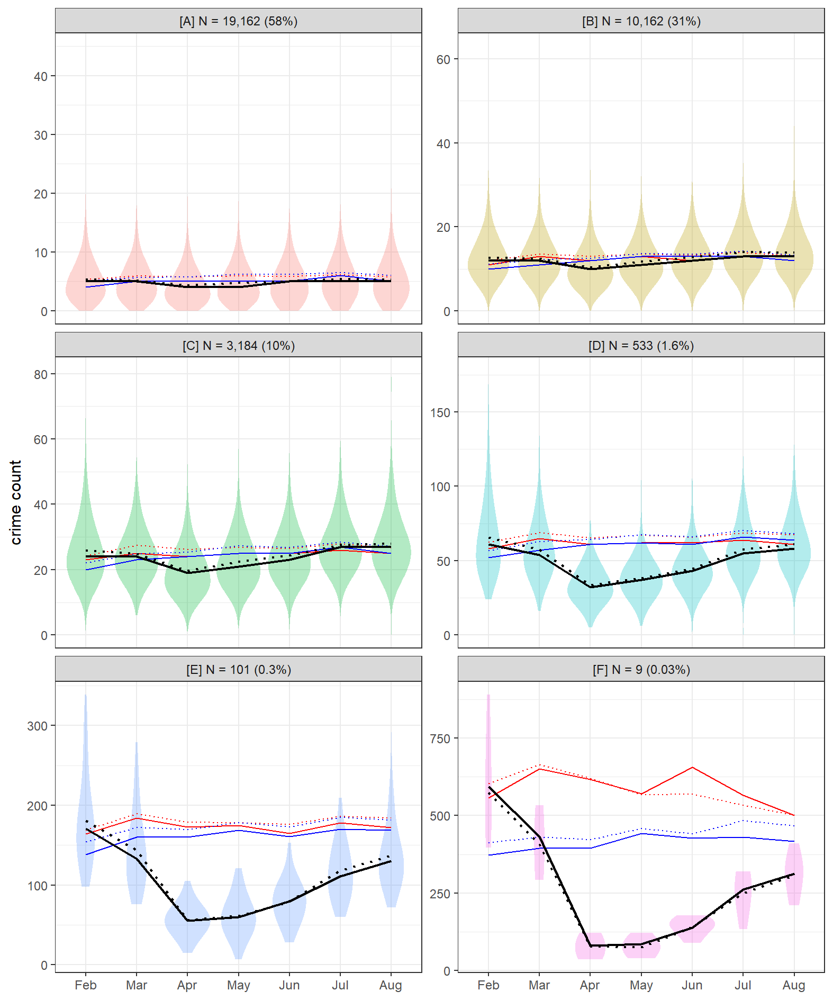

```{r setup, include=FALSE, echo = F}
knitr::opts_chunk$set(echo = FALSE)
library(readr);library(kableExtra)
```

## Introduction

- An evidence-base has begun to emerge around the impact of the COVID-19 pandemic on crime.
- Most studies have focused on macro-level units of analysis, such as cities or countries.
- Findings have tended to demonstrate a widespread decline in police-recorded crime.
- The longitudinal patterns observed are largely consistent with opportunity perspectives on crime.
- As such, we are beginning to garner a reasonable evidence-base around the impact of the pandemic lockdown on crime at the macro-level.
- That said, less is known about the localized drivers of the fall in police-recorded crime, and the degree of which areas have experienced the lockdown crime drop in unison.
- This challenge speaks to two strands of literature. Firstly, crime concentration research examining localized instability during crime drops [@andresen2017trajectories] and secondly, examinations of inequality in the exposure to crime in a drop scenario [@ignatans2016whom; @akmed2021mon; @mcvie2020increasing].
- Here, we disentangle the macro-level drop in police-recorded notifiable offences (excluding drugs) in England and Wales (see Langton et al., 2021) between February and August 2020, aggregating data to neighbourhood units (N = 33,075).
- We do this using non-parametric longitudinal clustering, which identifies areas which remained stable, even amidst nationwide volatility, and disentangles the areas which drove the initial decline and subsequent resurgence.
- Findings are augmented with a breakdown of the facilities present in each cluster, using data sourced from Open Street Map, and the crime type profile of each cluster.
- Results are discussed in the context of geographic inequalities and opportunity theories of crime.

## Background

- Recent months have seen a wave of interest in describing and explaining changes in  police-recorded crime in response to restrictions on mobility brought about by efforts to limit the spread of COVID-19.
- Generally speaking, findings have been consistent with theoretical expectations from an opportunity perspective, namely, that lockdown restrictions disrupted the convergence of motivated offenders, (in)capable guardians and suitable targets, bringing about widespread, macro-level declines in crime.
- Some notable cases demonstrate that changes may be specific to crime type, although some studies using longer time periods have shown that change has been relatively uniform across crime types, with some exceptions (Langton et al., 2021).
- Findings hold important practical and theoretical value for crime science research, and yet, less is known about the localized drivers of macro-level trends. 
- Questions around the drivers of macro-level crime drops have been of interest for some time, following the widespread fall in crime since the 1990s [@farrell2014crime; @weisburd2012criminology; @weisburd2004trajectories; @bannister2018local].
- At the city level, numerous studies have deployed longitudinal clustering methods to unmask localized variation in the crime drop. Findings have consistently found that macro-level declines in crime over many years (decades) tend to be driven by a disproportionately small number of places, with most areas remaining fairly stable.
- Here, we are presented with a unique scenario. Rather than a gradual decline in police-recorded crime over many decades, we have witnessed a rapid decline over a matter of weeks and months. And yet, comparable questions remain.
- To what extent have areas experienced this decline in unison? Have the dividends of the lockdown crime drop been shared equitably across space [@akmed2021mon]?
- Here, we use 7-months of police-recorded crime in England and Wales, aggregated to meso-level local units, to disentangle the nationwide lockdown crime drop.
- We describe areas in terms of their opportunity structure and crime type profile.

## Data and Method

### Crime data

- Police-recorded crime data for England and Wales (excluding Greater Manchester) between February and August, covering the first six months of lockdown March to August, and the preceding month (February), for comparison.
- Data is available for thirteen notifiable offences, and anti-social behaviour (ASB).
- As demonstrated in Langton et al., 2021 most notifiable offences experienced dramatic declines during April, the first full month of lockdown nationwide. 
- Exceptions are drugs and ASB.
- We provide context and a summary of nationwide trends decomposed by crime type in terms of raw trends (counts) and concentration (Generalized Gini coefficient).
- We then proceed with a broader 'notifiable offences (excluding drugs)' category.

### Unit of analysis

- Data is aggregated to Lower Super Output Area level, a neighborhood unit designed to be uniform by resident population (~ 1500 people), of which there are around 33,000 in England and Wales.
- Due to some LSOA not having police.uk snap points, and one LSOA not having any police-recorded notifiable offences during the study period, we end up with a final sample/population size of N = 33,075.

### Open Street Map

- Data on facilities to describe the LSOA clusters obtained are retrieved from the Open Street Map API using the `osmdata` package [@osmrpack] in R [@rman].
- Four count measures were chosen based on established crime attractors and generators, and availability and feasibility of obtaining nationwide data from Open Street Map, namely: nightlife, shops, public transport and bicycle parking.
- Measure simply represent node counts.
- Nightlife: pubs, nightclubs, restaurants.
- Shops: convenience stores, malls, shoe shops, department stores, clothes shops, electrical shops, supermarkets, chemists, greengrocers.
- Public transport: bus stops and railway stations.
- Bicycle parking: bicycle parking.
- Descriptive statistics on these counts at LSOA level are reported for each cluster solution.
- To supplement these statistics, which as discussed later, are imperfect, we provide access to an interactive map for readers to explore independently.

### Method 
- We set the background with descriptive statistics on macro-level trends (raw counts) and concentration (generalized Gini coefficient) by crime type, including the total crime category.
- This provides the 'global' picture of raw change and concentration at the national level, setting the reference point from which we can unmask the local variability underpinning the macro-level change.
- For the main analysis, we deploy k-means [@genolini2011kml; @genolini2015kml], a non-parametric longitudinal clustering technique, on notifiable offences counts trajectories at LSOA level.
- K-means has been used in crime concentration research to disentangle local variation from macro-level trends [@andresen2017trajectories; @curman2015crime].
- Its deployment was largely inspired by a popular technique, group-based trajectory modelling (GBTM) [@weisburd2004trajectories].
- K-means has a number of benefits over GBTM for crime and place research (detailed in @curman2015crime) but in this scenario, it has a unique advantage, in that it is highly capable of identifying short-term fluctuation, unlimited by polynomial terms [@akmed2021mon].
- In this way, it is suitable for usage in this 'natural experiment' scenario, whereby we expect change to occur rapidly and dramatically from one month to the next, rather than smoothed over many years.
- Cluster solution is determined by the Calinski-Criterion [@calinski1974dendrite] in alignment with existing studies in crime concentration research [@andresen2017trajectories; @akmed2021mon].

## Results

### Nationwide trends

- Raw counts by crime type confirm what has been demonstrated in existing accounts of lockdown crime in England and Wales (Langton et al., 2021).
- Here, we augment these existing crimes with a 'total crime (excluding drugs)' category, representing all notifiable offences with the exception of drugs.
- Drug crimes are thought to largely reflect police proactivity rather than a genuine shift in criminal behavioral.
-  We accept that granularity is lost with examining notifiable offences in their totality. We address this using a crime type breakdown, and return to it in more detail for the discussion.

```{r crimeoverall, fig.pos = 'H', message=F, comment=F, warning=F, fig.cap = "Macro-level crime trends in England and Wales during the lockdown period in 2020."}
knitr::include_graphics("visuals/raw_counts_gg.png")
```

### Nationwide concentration

- We note from the Generalized Gini coefficients that most crime types experienced remarkably stable 'global' concentration, even amidst this dramatic volatility in crime counts.
- Exceptions include bicycle theft, theft from the person, other theft, robbery, and to some extent vehicle crime.
- These experienced a fall in concentration (i.e. crimes were less concentrated, more spread out) compared to 2019.
- Overall, however, notifiable offences (excluding drugs) experienced minimal change. There is a marginal dip in concentration during the first month of lockdown, quickly returning to normal levels of concentration as crime surged back upwards during summer.

```{r crimegini, fig.pos = 'H', message=F, comment=F, warning=F, fig.cap = "Measure of concentration using the generalized Gini coefficient during the lockdown period."}
knitr::include_graphics("visuals/gini_gg.png")
```

- Based on these raw counts and Gini concentration trends over time, we might expect localized variability in notifiable offences. 
- Have neighborhoods experienced these trends collectively and uniformly? Can we attribute most of the macro-level count trends to a handful of areas? To what extent have the dividends of the crime drop been shared equitably across the country [@akmed2021mon]?
- What is the oppportunity structure of the areas driving nationwide trends?
- What is the crime type profile of the areas driving nationwide trends?

### Longitudinal clustering

#### Cluster trends

- Figure 3 visualizes the cluster solution generated by k-means, with 6-clusters identified as optimal based on the Calinski-Criterion [@calinski1974dendrite].
- Black solid line is the median count of the cluster at any given time point, with the black dotted line showing the mean.
- Violin plots have been added to convey the variation in counts at each time point. Here, we note that distributions were fairly uniform, with the mean and median representing the cluster solutions fairly well. There is little overlap between clusters.
- For reference to what trends we may have expected in a 'typical' year without the pandemic, we have added the mean and median trend lines for each cluster during 2018 (in blue) and 2019 (in red).
- This demonstrates that the clusters identified using the 2020 data were distinct and meaningful even in previous years, and highlights the gap between previous years and what has been observed during the pandemic.
- Overall, we note that most LSOA were remarkably stable during the pandemic. Clusters A and B can be described and 'low crime and stable', exhibiting fairly low counts throughout the study period and across years. Together, these clusters comprise 89% of LSOAs in England and Wales.
- That said, there is some deviation from previous years in April, in alignment with expectations. There is a slight dip in the mean and median crime count, particularly in Cluster B.
- The third largest cluster, cluster C, comprises 10% of all LSOAs in the country. This cluster experienced a more prominent dip in crime, along with cluster D (1.6% of LSOAs). Together, we might describe these LSOAs as 'mid-crime, mid-drop'. 
- However, the 'action' appears to be occurring amongst a small subset of LSOAs, contained within clusters E and F. Together, these clusters comprise only 0.33% of all LSOA in the country (N = 110), however they are 'high crime, major drop'.
- Interestingly, clusters E and F represent the only clusters which did not return back to normality by August (if we assume that 2018 and 2019 represent a trend which we might have otherwise expected).
- Overall, we note that despite the dramatic nationwide trend in notifiable offences (excluding drugs), there has been remarkable stability in local areas, with most change being driven by a small number of areas.

```{r kmeansnotoff, fig.pos = 'H', message=F, comment=F, warning=F, fig.cap = "K-means cluster solutions for LSOA notifiable offences. Mean (dotted line) and median (solid line) are shown for each cluster for 2020 (black), 2019 (red) and 2018 (blue) respectively. Distributions refer to 2020 only.", out.width= "90%"}

```

#### Contribution of each cluster

- To further unpick the contribution of these clusters to the nationwide lockdown crime drop, Figure 4 plots the monthly change in counts of each cluster.
- Alongside these raw counts, we also include the percentage of total absolute change (i.e. positive or negative) attributable to each cluster.
- We use this to identify which clusters drove the initial decline and subsequent resurgence nationwide.
- As expected, the vast majority of change occurred between March and April.
- However, Figure 4 demonstrates that this substantial decline did not occur equitably across the country. Consistent with the cluster solutions trends in Figure 3, it is clear that a small number of areas drove the trend.
- For instance, clusters A and B, which comprise 89% of LSOAs in the country, accounted for only 47% of the decline between March and April.
- By contrast, clusters E and F, which together comprised only 0.33% of LSOA (N = 110) contributed to 15% of the nationwide drop between months. This a disproportionately large impact of the macro-level trend, and further supports the observation that most areas remained fairly stable.
- Interestingly, this picture shifts upon the beginning of the resurgence between April and May.
- Cluster A continues to contribute a disproportionately small amount to nationwide change, but cluster B contributes to 42% of the increase, despite only comprising 31% of LSOA.
- The contribution of the smallest clusters E and F is remarkably small compared to the initial decline, 2% and 0% respectively. This can be largely attributed to the flattening of their crime count trends between these months. In other words, following their initially steep decline between March and April, crime remained reasonably unchanged between April and May in these areas.
- Overall, this pattern continues throughout the spring convergence back to normality, with some notable changes. 
- Following the period of stabilization, clusters E and F gather pace during the resurgence, as does cluster D. For instance, between June and July, these three clusters account for nearly a third of the nationwide increase, despite comprising less than 2% of total LSOA.
- July to August represents an interesting period. Until that point, each cluster, despite their vastly differing relative contributions to change, were directionally homogeneous. In other words, every cluster declined between February and April, and then increased between April and July.
- Between July and August, clusters began to diverge. Nationwide, there was a marginal increase in notifiable offence counts (see Figure 1), but this masks a great deal of localized variability.
- The two large, low crime clusters (A and B) actually declined again between July and August, while the higher crime clusters continued to increase. This is suggestive of a local change in opportunities as lockdown rules were relaxed - change which has been aggregated away at the macro-level.
- In other words, low crime areas mitigated against further nationwide increases which may, if they had continued, actually resulted in a higher crime count in August than observed in 2019.

```{r changeline, fig.pos = 'H', message=F, comment=F, warning=F, fig.cap = "Counts and percentage of nationwide change between months attributable to each cluster.", out.width= "100%"}
knitr::include_graphics("visuals/change_k6_gg.png")
```


### Spatial distribution of clusters

- List major city composition?
- Maps of major city case studies?
- Link to interactive map?

### Characteristics of clusters

- We have now identified that, amidst dramatic nationwide change in notifiable offences during lockdown, and stability in overall crime concentrations, there has been considerable underlying volatility, with a small number of local areas driving the macro-level trends.
- From an opportunity perspective, we expect the clusters to have differing opportunity structures.
- For instance, LSOA which were typically 'high crime' in 2018 and 2019, and then experienced a dramatic fall in crime upon lockdown commencement, are likely to have a large volume of criminal opportunities which were closed off following restrictions on mobility.
- On the other hand, areas which were typically low crime, and remained low crime, are likely to have a vastly different opportunity structure: places with minimal attractors or generators to begin with are unlikely to have changed dramatically during lockdown.
- Table 1 demonstrates this point using the data obtained from Open Street Map.
- Clusters A and B, the 'low crime and stable' LSOAs, tend to have few major opportunities for crime. Few pubs, nightclubs or restaurants to generate a violence and theft-prone nightlife, minimal shopping opportunities (and thus less chance of shoplifting), limited public transport (less theft) and less bicycle parking (less bicycle theft).
- By contrast, the 'high crime major drop' clusters (e.g. E and F) are major nightlife areas, have considerable shopping opportunities, often have expansive public transport networks, and have many bicycle parking facilities.
- These findings are consistent with what is observed using the interactive map made available as part of this paper (link here).

```{r thresht, warning=F, message = F}
osm_stats_df <- read_csv("data/osm_stats_sub_rounded_k6.csv")

osm_table <- kable(osm_stats_df, caption = "Descriptive statistics of facilities in each cluster. Sourced from Open Street Map.",
      booktabs = T, longtable = T, linesep = "", format = "latex") %>%
    kable_styling(latex_options = c("basic"),
                  font_size = 8, full_width = F)

column_spec(osm_table, c(1:9), width = c("0.7cm", "1.5cm", "1.5cm", "1.5cm", "1.5cm", "1cm", "1cm", "1.5cm", "1cm"))
```

#### Crime type profile

- For the purposes of simplicity and setting a benchmark, we have been using a measure of 'notifiable offences excluding drugs' for analysis.
- That said, we might expect the clusters identified to have different crime type profiles.
- Given the differing opportunity structures between clusters, the 'typical' crime profiles of each cluster may change considerably as lockdown commences.
- Alternatively, the pervasiveness of lockdown on mobility may have impacted on crime types uniformly within each cluster, in which case, we may see stability in crime type profiles before and after lockdown.
- Figure 5 summarises the profile of each cluster by calculating the proportion of total crime in each cluster.
- We observe considerable stability in the distribution of crime types both within and between clusters.
- Violence and sexual offences represent the most prevalent crime type across all clusters. The proportion of total crime in each cluster attributable to violence and sexual offences increases in the first two months of lockdown.
- This by no means implies that violence and sexual offences increased, but rather, that violence and sexual offences declined at a slower rate than other crime types, increasing its share of all crimes.
- In cluster F, we see a unique pattern, whereby theft from the person and other theft are squeezed considerably into April and May, while the share of public order increased.
- This might reflect the opportunity structures of LSOA in cluster F being weighted heavily towards theft (e.g. lots of public transport nodes).
- At the same time, the increase share in public order may reflect other activity, such as the protests around BLM and anti-lockdown movements, which take place in city centres for coverage.

```{r crimeprofile, fig.pos = 'H', message=F, comment=F, warning=F, fig.cap = "Crime type characteristics of each cluster solution.", out.width= "90%"}
knitr::include_graphics("visuals/traj_crimes_monthly_k6_gg.png")
```

## Discussion

- We have investigated the degree of stability and localised inequality in the lockdown crime drop between February and August in England and Wales using police-recorded crime data aggregated to local areas (LSOA).
- Findings are largely consistent with broader findings around inequalities in the crime drop and the notion that a small number of fine-grained geographic areas tend to drive nationwide trends [@andresen2017trajectories; @weisburd2012criminology; @mcvie2020increasing].
- Specifically, we find that most LSOA remained remarkably stable during the initial, major lockdown crime drop between March and April.
- The subsequent resurgence among low and mid-crime areas was limited by 'high crime' areas stabilizing into May.
- But, the resurgence of high crime areas was lagged, and began towards the end of spring.
- Further macro-level increases in crime at the end of summer were limited by the low crime and stable areas, mitigating the impact of increases in high crime clusters.
- The LSOA which drove the lockdown crime drop tended to have considerable crime attractors and generators, such as public transport nodes, an active nightlife, and plenty of shops and bicycle parking.
- Thus, while the opportunity structures of these areas makes them high crime areas in typical times, in a lockdown scenario, these are the areas which are most impacted by changes in mobility, driving crime down. 
- The crime type profile of clusters demonstrates considerable stability.

## Appendix
