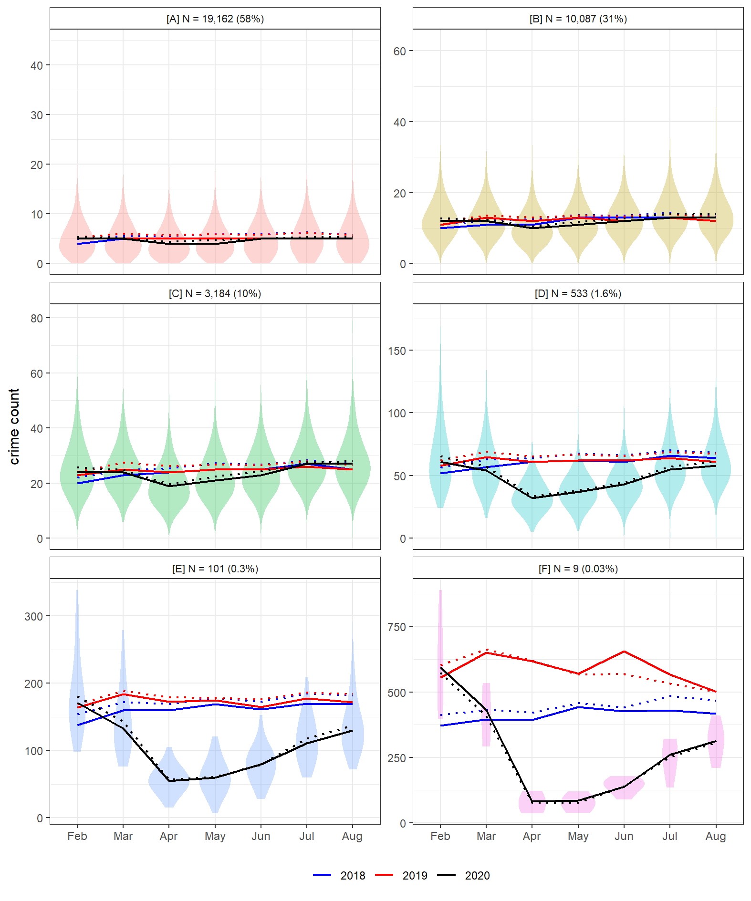

```{r setup, include=FALSE, echo = F}
knitr::opts_chunk$set(echo = FALSE)
library(readr);library(kableExtra)
```

# Introduction

Efforts to slow the spread of COVID-19 through social distancing and restrictions on citizen mobility have induced dramatic and unprecedented changes in police-recorded crime. Studies from international case study sites including the United States, United Kingdom and Australia have reported a decline in most crime types following the imposition of "stay at home" (or equivalent) orders [@estevez2020crime]. Generally speaking, findings have aligned with expectations from opportunity perspectives on crime. Lockdown mobility patterns disrupted the typical convergence of motivated offenders, suitable targets and capable guardians, reducing opportunities for victimization [@stickle2020crime]. As lockdown restrictions were slowly repealed, routine activities converged back to pre-pandemic levels and we witnessed a resurgence in criminal activity [@langton2021cs].

While existing studies have provided insight into the opportunity structures of crime, and the nuances of using police data to study lockdown as a natural experiment [@stickle2020crime; @langton2021cs] research has almost exclusively been undertaken using macro-level units of analysis, such as cities or countries. Less is known about the localized drivers of the lockdown crime drop or the degree to which macro-level trends are masking geographic inequalities in victimization. Pre-pandemic research examining the (in)stability of crime at fine-grained spatial scales [@weisburd2012criminology; @curman2015crime] and inequalities in the crime drop [@mcvie2020increasing; @ignatans2016whom; @akmed2021mon] would certainly suggest that local areas are unlikely to have experienced the macro-level lockdown crime trends in unison. Rather, we might expect specific places, typically associated with high ambient populations and plentiful opportunities for crime, to have driven the wider trend, with most localized areas remaining fairly stable.

Examining the localized drivers of the lockdown crime drop represents the primary motivation of this paper. We disentangle the macro-level drop in police-recorded crime observed in England and Wales between February and August 2020. We deploy non-parametric longitudinal clustering to identify clusters of meso-level units which contributed disproportionately to the nationwide drop and subsequent resurgence in crime during the nationwide lockdown. The spatial patterning, opportunity structure and crime type profile of these local areas are quantified and summarized for their consistency with expectations for opportunity and mobility theories of crime [@halford2020crime].

# Background

- Recent months have seen a wave of interest in describing and explaining changes in  police-recorded crime in response to restrictions on mobility brought about by efforts to limit the spread of COVID-19.
- Generally speaking, findings have been consistent with theoretical expectations from an opportunity perspective, namely, that lockdown restrictions disrupted the convergence of motivated offenders, (in)capable guardians and suitable targets, bringing about widespread, macro-level declines in crime.
- Some notable cases demonstrate that changes may be specific to crime type, although some studies using longer time periods have shown that change has been relatively uniform across crime types, with some exceptions (Langton et al., 2021).
- Findings hold important practical and theoretical value for crime science research, and yet, less is known about the localized drivers of macro-level trends. 
- Questions around the drivers of macro-level crime drops have been of interest for some time, following the widespread fall in crime since the 1990s [@farrell2014crime; @weisburd2012criminology; @weisburd2004trajectories; @bannister2018local].
- At the city level, numerous studies have deployed longitudinal clustering methods to unmask localized variation in the crime drop. Findings have consistently found that macro-level declines in crime over many years (decades) tend to be driven by a disproportionately small number of places, with most areas remaining fairly stable.
- Here, we are presented with a unique scenario. Rather than a gradual decline in police-recorded crime over many decades, we have witnessed a rapid decline over a matter of weeks and months. And yet, comparable questions remain.
- To what extent have local areas experienced this decline in unison?
- Can we attribute most of the macro-level count trends to a handful of meso-level areas? 
- Have the dividends of the lockdown crime drop been shared equitably across space [@akmed2021mon]?
- Here, we use 7-months of police-recorded crime in England and Wales, aggregated to meso-level local units, to disentangle the nationwide lockdown crime drop.
- We describe areas in terms of their opportunity structure, spatial patterning and crime type profile.

# Data and Method

To examine localized instability in the lockdown crime drop, we make use of three data sources, namely, open police-recorded crime data, geographic boundaries from Ordnance Survey and the Office for National Statistics (ONS), and data sourced from the Open Street Map API. Each of these are now outlined in turn, followed by an outline of the methods deployed. Code to replicate the data downloads, handling, analyses and visualization reported here is openly available (https://github.com/langtonhugh/covid_spatial). 

### Crime data

Open police-recorded data on crime and anti-social behavior in England and Wales is published through an online web portal (https://data.police.uk/). Individual records are released on a month-by-month basis for each of the 43 police forces comprising England and Wales. We used a study period spanning February to August 2020 in order to capture the first six months of the nationwide lockdown (March to August) and the one month preceding the change (February). For reference and comparison to historical trends, we obtained data for the same months in 2018 and 2019. Individual records are time-stamped by month -- the temporal scale of this study. Due to ongoing data issues with Greater Manchester Police, we excluded data from this region, and therefore collated data from 42 out of 43 forces in England and Wales.

Individual open records categorize crime according to thirteen different notifiable offence categories (e.g. burglary, violence and sexual offences, theft from the person, vehicle crime).^[Further information on these crime categories can be obtained from https://www.police.uk/pu/contact-the-police/what-and-how-to-report/what-report/.] Records also include anti-social behaviour (ASB) which usually captures less serious offences such as nuisance behavior and is not a notifiable offence. Individual records were aggregated to create count measures by month for the thirteen notifiable offences and ASB. These are used in the initial stages of analyses to provide a background overview of nationwide trends in crime and concentration before and after lockdown. For the primary cluster analysis, we use a count measure comprised of notifiable offences excluding drug crimes. This is due to the widespread recognition that drug crime trends, particularly during the COVID-19 lockdown, largely reflect policing proactivity rather than meaningful shifts in criminal behavior [@langton2021cs]. Recognizing that aggregating data across crime types can mask variation [@andresen2017trajectories] we later decompose our findings according to the twelve remaining notifiable offences.

### Unit of analysis

For localized monthly analysis, notifiable offences (excluding drugs) were aggregated by Lower Super Output Area (LSOA). LSOA are a meso-level geographic units designed for the reporting of official statistics at small geographies [@onslsoa]. England and Wales is comprised of 32,844 LSOA designed to be uniform by resident population size. In 2019, LSOA housed an average of 1,700 people. Data obtained from the open police data portal (see previous section) includes a pre-assigned field stating the LSOA in which the crime occurred, as recorded by the police. Due to the spatial anonymization method used prior to data release, LSOA are the lowest level of aggregation at which we can reasonably assume spatial accuracy across multiple crime types [@tompson2015uk]. Boundaries reflect 'on the ground' characteristics such as roads and railways [@onslsoachange], and as such, we consider LSOA to represent meaningful behavioral spaces to study the opportunity structures of crime.

After removing crimes recorded by Greater Manchester Police, crimes recorded to have occurred within the Greater Manchester region, and four LSOAs which contained no crime between 2018 and 2020 (likely due to the spatial anonymization process), our final sample population for the meso-level analysis comprised 33,075 LSOAs.

### Open Street Map

To summarize the opportunity structure of local areas we required a nationwide dataset of theoretically relevant facilities and urban features which could be aggregated at the LSOA level. To this end, we obtained point-level data from the Application Programming Interface (API) for Open Street Map via the `osmdata` package [@padgham2017osmdata] in `R` [@team2013r]. Open Street Map is a crowdsourced geospatial database containing a vast array of features which can be used for explaining the temporal and spatial patterning of crime [@langton2020open]. Geographic features are identified by pairs of keys and values which can be used to computationally query the API for data. Based on existing research examining the opportunity structures of fine-grained spatial scales, we collated the coordinate locations of the following facilities:

- Nightlife: pubs, nightclubs, restaurants.
- Shops: convenience stores, malls, shoe shops, department stores, clothes shops, electrical shops, supermarkets, chemists, greengrocers.
- Public transport: bus stops and railway stations.
- Bicycle parking: bicycle parking lots.

The point-level data on these features were aggregated to create counts for each facility by LSOA. For simplicity, and due to issues of data sparsity, we sum the counts for each facility according to their overarching description (i.e. nightlife, shops, public transport, bicycle parking). We hypothesize that LSOAs containing a high number of facility counts across each domain will have higher pre-pandemic levels of crime, due to the plentiful opportunities for criminality, and in turn, steeper declines in crime following lockdown due to such opportunities suddenly becoming unavailable. We expect areas with _low_ counts across these domains to have similarly low crime levels pre-lockdown, and thus will remain low and stable following lockdown commencement.

## Method 

Analyses to examine the localized variation in the lockdown crime drop are conducted in three principal stages. First, an overview of nationwide (macro) trend is provided by crime type in terms of both absolute counts and the degree of concentration. Second, the macro-level trend is disentangled using non-parametric clustering techniques notifiable offences (excluding drugs) on the LSOA (meso) units (N = 33,075). Third, the characteristics of each cluster will be summarized in terms of their opportunity structures, spatial patterning and crime type profile. We conclude with a reflection on the findings given the crime profiles observed.

### Macro-level descriptives

Macro-level descriptives of count trends and concentration by offence type are reported for provide context from which we will subsequently unmask local (meso) variation. First, we visualize observed crime counts between February and August 2020 relative to the same periods in 2018 and 2019 by offence type. In doing so, we can observe how nationwide crime trends changed in the face of lockdown measures [see also @langton2021cs]. Second, we visualize generalized Gini coefficients [@bernasco2017more] to describe the degree of which crimes became more (or less) concentrated during lockdown at LSOA level. Again, we report figures for 2018 and 2019 as a point of reference. We use the generalized version of the Gini coefficient to account for data sparsity, as in some cases, the number of crimes fell below the number of LSOAs in the study region. Measures of counts and concentration set scene from which we can disentangle the underlying, meso-level variation.

### Meso-level clustering 

To quantify the degree of meso-level uniformity underpinning the macro-level trend, and identify the potential drivers of the lockdown crime drop, we deploy a longitudinal variant of k-means clustering [@genolini2011kml; @genolini2015kml]. This non-parametric clustering technique has an established role in crime and place research for examining the longitudinal trajectories of local areas in a macro-level crime drop scenario [@curman2015crime; @andresen2017trajectories].

Here, we note that the experimental conditions of the COVID-19 lockdown make the usage of k-means particularly suitable. Existing research adopting the method has tended to investigate _long-term_ change over years or decades, focusing on the directional homogeneity (e.g. increasing, decreasing or stable) of clusters, rather than short-term volatility [@andresen2017trajectories]. And yet, one key strength of k-means is that it is capable of identifying short-term fluctuation in longitudinal trends [@akmed2021mon]. In this lockdown scenario, the availability of criminal opportunities were withdrawn quite literally overnight, and thus we might expect a similarly rapid and short-term change in crime at fine-grained spatial scales. This sets k-means apart from equivalent model-based methods restricted by polynomial terms, such as group-based trajectory modelling [@weisburd2004trajectories] and non-parametric techniques designed for long-term rather than short-term change [@akmed2021mon].

We deploy k-means using the `kml` package [@kmlpack] in R on notifiable offences (excluding drugs) counts for LSOAs in the study region (N = 33,075) between February and August 2020. To achieve a parsimonious cluster solution while minimizing the risk of missing underlying variation, we proposed potential solutions using three, four, five and six clusters respectively, choosing the final solution based on the Calinski-Criterion [@calinski1974dendrite]. For each potential solution, twenty redraws with different starting conditions were run to ensure that solutions were stable (see Appendix). This indicated that the optimal cluster solution contained six clusters.

We visualize the final cluster solution in a manner which conveys the underlying distribution of observations comprising each cluster at each time point, rather than reporting a summary statistic (e.g. the mean trajectory) in isolation, as has been in the case in existing research. For each cluster, we also overlay the equivalent trajectories for 2018 and 2019 as a reference point for comparison to a 'typical' year. In doing so, we aim to not only identify localized (in)stability in the lockdown crime drop, but also assess the extent to which the trends observed have deviated from previous years.

### Cluster characteristics

We expect that the meso-level areas driving the lockdown crime drop will be those with plentiful opportunities for crime. That is, a disproportionately large volume of the decline (and subsequent resurgence) will be attributable to a handful of places which had pre-existing high crime levels as a result of their opportunity structure. Using the measures for opportunity generated from Open Street Map (i.e. nightlife, shops, public transport and bicycle parking), we report descriptive statistics on facility counts for each of the clusters obtained from the k-means analysis. In doing so, we expect to unpick a meaningful pattern which is consistent with the opportunity perspective of crime.

To supplement this, we visualize the spatial patterning of the cluster solutions. For brevity and simplicity, we focus on Birmingham, Liverpool, Leeds, Bradford, Sheffield and Cardiff. We have excluded Greater Manchester due to the lack of police data, and given its size, we determined Greater London to warrant an individual case study for future research. Given these exclusions, the six cities we report represent the five most populous cities in England, and the most populous city in Wales.

Finally, recognizing the unique opportunity structure of specific crimes, we summarize the crime type profile of clusters. For each cluster, we report the percentage breakdown of crimes types. We suspect that clusters will have differing crime type profiles according to the opportunity structures of each grouping.

# Results

## Nationwide trends

To set the context for the localized analysis, Figure 2 visualizes crime counts between February and August 2020 for the thirteen notifiable offences, anti-social behavior, and notifiable offences excluding drugs. This descriptive analysis confirms what has been demonstrated using model-based forecasting analyses elsewhere (Langton et al., 2021). In April, the first full month of lockdown in England and Wales, we observe a widespread decline across most notifiable offences in comparison to previous years. One key exception is drug crimes, which as noted, is thought to have increased as a result of policing proactivity. Public order and violence and sexual offences experienced a dramatic decline in April, but appear to deviate little from previous years. This is due to long-term increase in these crime types (see Appendix A). The aggregate crime category, notifiable offences (excluding drugs) demonstrates a clear decline in March and April, followed by a resurgence to normality by August. This represents the 'global' trend which we will subsequently disentangle using localized analyses.

Figure 3 visualizes the overall level of concentration across these offence types before and after lockdown, and in comparison to previous years, using the generalized Gini coefficient. Here, we note that most crime types experience remarkably stable concentration, even amidst volatile and sharply changing levels in absolute counts (see Figure 2). For many crime types, the degree of concentration is almost indistinguishable compared to 2018 and 2019. Exceptions include bicycle theft, theft from the person, other theft, robbery, and (to a lesser extent) vehicle crime. These experienced a fall in concentration (i.e. crimes were less concentrated, more spread out) compared to previous years. Overall, notifiable offences (excluding drugs) experienced minimal change. There is a marginal dip in concentration during the first month of lockdown, quickly returning to normal levels of concentration as crime surged back upwards during summer.

Based on the dramatic decline and subsequent resurgence of notifiable offences (excluding drugs) during the study period, we might expect some localized variability. Measures of concentration indicate that there has been stability at the 'global' level, but the evidence-base surrounding the law of crime concentration and micro-place (in)stability would certainly give reason to suspect that this masks underlying volatility [@weisburd2015law; @andresen2017trajectories].

```{r nocounts, fig.pos = 'H', message=F, comment=F, warning=F, fig.cap = "Macro-level crime trends in England and Wales during the lockdown period in 2020."}
knitr::include_graphics("visuals/no_raw_counts_gg.png")
```

## Longitudinal clustering

### Cluster trends

- Figure 3 visualizes the cluster solution generated by k-means, with 6-clusters identified as optimal based on the Calinski-Criterion [@calinski1974dendrite].
- Black solid line is the median count of the cluster at any given time point, with the black dotted line showing the mean.
- Violin plots have been added to convey the variation in counts at each time point. Here, we note that distributions were fairly uniform, with the mean and median representing the cluster solutions fairly well. There is little overlap between clusters.
- For reference to what trends we may have expected in a 'typical' year without the pandemic, we have added the mean and median trend lines for each cluster during 2018 (in blue) and 2019 (in red).
- This demonstrates that the clusters identified using the 2020 data were distinct and meaningful even in previous years, and highlights the gap between previous years and what has been observed during the pandemic.
- Overall, we note that most LSOA were remarkably stable during the pandemic. Clusters A and B can be described and 'low crime and stable', exhibiting fairly low counts throughout the study period and across years. Together, these clusters comprise 89% of LSOAs in England and Wales.
- That said, there is some deviation from previous years in April, in alignment with expectations. There is a slight dip in the mean and median crime count, particularly in Cluster B.
- The third largest cluster, cluster C, comprises 10% of all LSOA in the country. This cluster experienced a more prominent dip in crime, along with cluster D (1.6% of LSOAs). Together, we might describe these LSOAs as 'mid-crime, mid-drop'. 
- However, the 'action' appears to be occurring amongst a small subset of LSOAs, contained within clusters E and F. Together, these clusters comprise only 0.33% of all LSOA in the country (N = 110), however they are 'high crime, major drop'.
- Interestingly, clusters E and F represent the only clusters which did not return back to normality by August (if we assume that 2018 and 2019 represent a trend which we might have otherwise expected).
- Overall, we note that despite the dramatic nationwide trend in notifiable offences (excluding drugs), there has been remarkable stability in local areas, with most change being driven by a small number of areas.

```{r kmeansnotoff, fig.pos = 'H', message=F, comment=F, warning=F, fig.cap = "K-means cluster solutions for LSOA notifiable offences (excluding drugs). Distributions refer to 2020 only.", out.width= "90%"}

```

### Contribution of each cluster

- To further unpick the contribution of these clusters to the nationwide lockdown crime drop, Figure 4 plots the monthly change in counts of each cluster.
- Alongside these raw counts, we also include the percentage of total absolute change (i.e. positive or negative) attributable to each cluster.
- We use this to identify which clusters drove the initial decline and subsequent resurgence nationwide.
- As expected, the vast majority of change occurred between March and April.
- However, Figure 4 demonstrates that this substantial decline did not occur equitably across the country. Consistent with the cluster solutions trends in Figure 3, it is clear that a small number of areas drove the trend.
- For instance, clusters A and B, which comprise 89% of LSOAs in the country, accounted for only 47% of the decline between March and April.
- By contrast, clusters E and F, which together comprised only 0.33% of LSOA (N = 110) contributed to 15% of the nationwide drop between months. This a disproportionately large impact of the macro-level trend, and further supports the observation that most areas remained fairly stable.
- Interestingly, this picture shifts upon the beginning of the resurgence between April and May.
- Cluster A continues to contribute a disproportionately small amount to nationwide change, but cluster B contributes to 42% of the increase, despite only comprising 31% of LSOA.
- The contribution of the smallest clusters E and F is remarkably small compared to the initial decline, 2% and 0% respectively. This can be largely attributed to the flattening of their crime count trends between these months. In other words, following their initially steep decline between March and April, crime remained reasonably unchanged between April and May in these areas.
- Overall, this pattern continues throughout the spring convergence back to normality, with some notable changes. 
- Following the period of stabilization, clusters E and F gather pace during the resurgence, as does cluster D. For instance, between June and July, these three clusters account for nearly a third of the nationwide increase, despite comprising less than 2% of total LSOA.
- July to August represents an interesting period. Until that point, each cluster, despite their vastly differing relative contributions to change, were directionally homogeneous. In other words, every cluster declined between February and April, and then increased between April and July.
- Between July and August, clusters began to diverge. Nationwide, there was a marginal increase in notifiable offence counts (see Figure 1), but this masks a great deal of localized variability.
- The two large, low crime clusters (A and B) actually declined again between July and August, while the higher crime clusters continued to increase. This is suggestive of a local change in opportunities as lockdown rules were relaxed - change which has been aggregated away at the macro-level.
- In other words, low crime areas mitigated against further nationwide increases which may, if they had continued, actually resulted in a higher crime count in August than observed in 2019.

```{r changeline, fig.pos = 'H', message=F, comment=F, warning=F, fig.cap = "Counts and percentage of nationwide change between months attributable to each cluster.", out.width= "100%"}
knitr::include_graphics("visuals/change_k6_gg.png")
```


## Spatial distribution of clusters

- Link to interactive map

```{r  maps, fig.pos = 'H', message=F, comment=F, warning=F, fig.cap = "Spatial distribution of clusters by major urban conurbation.", out.width= "100%"}

```


## Characteristics of clusters

- We have now identified that, amidst dramatic nationwide change in notifiable offences during lockdown, and stability in overall crime concentrations, there has been considerable underlying volatility, with a small number of local areas driving the macro-level trends.
- From an opportunity perspective, we expect the clusters to have differing opportunity structures.
- For instance, LSOA which were typically 'high crime' in 2018 and 2019, and then experienced a dramatic fall in crime upon lockdown commencement, are likely to have a large volume of criminal opportunities which were closed off following restrictions on mobility.
- On the other hand, areas which were typically low crime, and remained low crime, are likely to have a vastly different opportunity structure: places with minimal attractors or generators to begin with are unlikely to have changed dramatically during lockdown.
- Table 1 demonstrates this point using the data obtained from Open Street Map.
- Clusters A and B, the 'low crime and stable' LSOAs, tend to have few major opportunities for crime. Few pubs, nightclubs or restaurants to generate a violence and theft-prone nightlife, minimal shopping opportunities (and thus less chance of shoplifting), limited public transport (less theft) and less bicycle parking (less bicycle theft).
- By contrast, the 'high crime major drop' clusters (e.g. E and F) are major nightlife areas, have considerable shopping opportunities, often have expansive public transport networks, and have many bicycle parking facilities.
- These findings are consistent with what is observed using the interactive map made available as part of this paper (link here).

```{r thresht, warning=F, message = F}
osm_stats_df <- read_csv("data/osm_stats_long.csv")

osm_table <- kable(osm_stats_df, caption = "Descriptive statistics of facilities and features in each cluster. Sourced from Open Street Map.",
      booktabs = T, longtable = T, linesep = "", format = "latex") %>%
    kable_styling(latex_options = c("basic"),
                  font_size = 8, full_width = F)

column_spec(osm_table, c(1:7), width = c("4cm", "1.5cm", "1.5cm", "1.5cm", "1.5cm", "1.5cm", "1.5cm"))
```

### Crime type profile

- For the purposes of simplicity and setting a benchmark, we have been using a measure of 'notifiable offences excluding drugs' for analysis.
- That said, we might expect the clusters identified to have different crime type profiles.
- Given the differing opportunity structures between clusters, the 'typical' crime profiles of each cluster may change considerably as lockdown commences.
- Alternatively, the pervasiveness of lockdown on mobility may have impacted on crime types uniformly within each cluster, in which case, we may see stability in crime type profiles before and after lockdown.
- Figure 5 summarises the profile of each cluster by calculating the proportion of total crime in each cluster.
- We observe considerable stability in the distribution of crime types both within and between clusters.
- Violence and sexual offences represent the most prevalent crime type across all clusters. The proportion of total crime in each cluster attributable to violence and sexual offences increases in the first two months of lockdown.
- This by no means implies that violence and sexual offences increased, but rather, that violence and sexual offences declined at a slower rate than other crime types, increasing its share of all crimes.
- In cluster F, we see a unique pattern, whereby theft from the person and other theft are squeezed considerably into April and May, while the share of public order increased.
- This might reflect the opportunity structures of LSOA in cluster F being weighted heavily towards theft (e.g. lots of public transport nodes).
- At the same time, the increase share in public order may reflect other activity, such as the protests around BLM and anti-lockdown movements, which take place in city centres for coverage.

# Discussion

- We have investigated the degree of stability and localised inequality in the lockdown crime drop between February and August in England and Wales using police-recorded crime data aggregated to local areas (LSOA).
- Findings are largely consistent with broader findings around inequalities in the crime drop and the notion that a small number of fine-grained geographic areas tend to drive nationwide trends [@andresen2017trajectories; @weisburd2012criminology; @mcvie2020increasing].
- Specifically, we find that most LSOA remained remarkably stable during the initial, major lockdown crime drop between March and April.
- The subsequent resurgence among low and mid-crime areas was limited by 'high crime' areas stabilizing into May.
- But, the resurgence of high crime areas was lagged, and began towards the end of spring.
- Further macro-level increases in crime at the end of summer were limited by the low crime and stable areas, mitigating the impact of increases in high crime clusters.
- The LSOA which drove the lockdown crime drop tended to have considerable crime attractors and generators, such as public transport nodes, an active nightlife, and plenty of shops and bicycle parking.
- Thus, while the opportunity structures of these areas makes them high crime areas in typical times, in a lockdown scenario, these are the areas which are most impacted by changes in mobility, driving crime down. 
- The crime type profile of clusters demonstrates considerable stability.

# Appendix

```{r crimeoverall, fig.pos = 'H', message=F, comment=F, warning=F, fig.cap = "Macro-level crime trends in England and Wales during the lockdown period in 2020."}
knitr::include_graphics("visuals/raw_counts_gg.png")
```

```{r crimegini, fig.pos = 'H', message=F, comment=F, warning=F, fig.cap = "Measure of concentration using the generalized Gini coefficient during the lockdown period."}
knitr::include_graphics("visuals/gini_gg.png")
```

```{r longterm, fig.pos = 'H', message=F, comment=F, warning=F, fig.cap = "Select crime types with long-term increases in counts.", out.width= "90%"}
knitr::include_graphics("visuals/long_term_gg.png")
```

```{r crimeprofile, fig.pos = 'H', message=F, comment=F, warning=F, fig.cap = "Crime type characteristics of each cluster solution.", out.width= "90%"}
knitr::include_graphics("visuals/traj_crimes_monthly_k6_gg.png")
```

# References