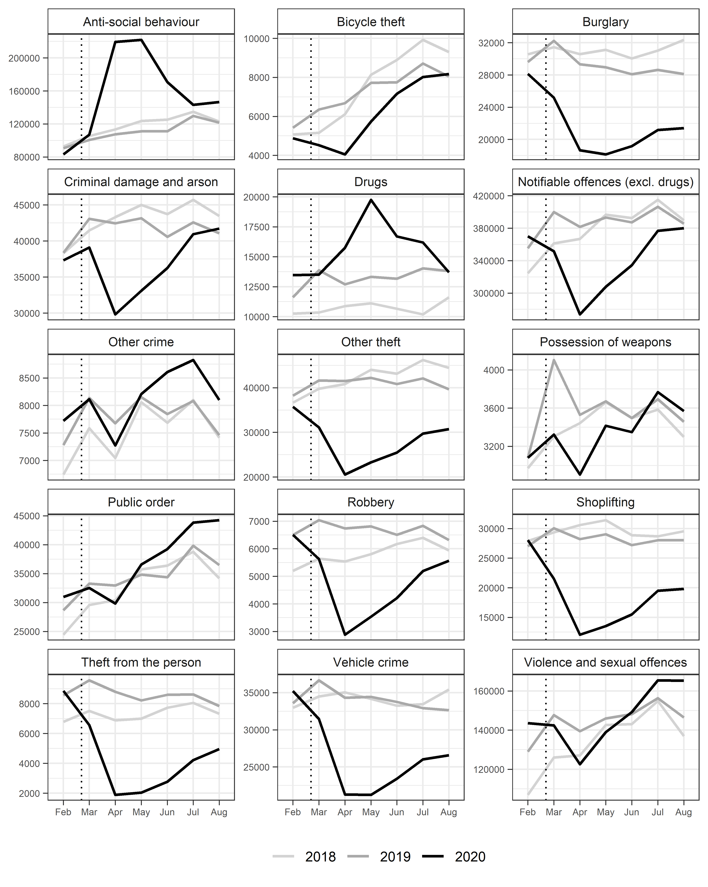

```{r setup, include=FALSE, echo = F}
knitr::opts_chunk$set(echo = FALSE)
```

## Introduction

- An evidence-base has begun to emerge around the impact of the COVID-19 pandemic on crime and anti-social behaviour.
- Findings have tended to demonstrate a widespread decline in police-recorded crime, although the extent to which this holds true varies by crime type.
- But, most studies have focused on macro-level units of analysis, such as cities or countries.
- A recent study took a 'look back' on the first six months of lockdown using police-recorded crime data aggregated to England and Wales.
- The macro-level longitudinal patterns observed were consistent with opportunity perspectives on crime.
- Here, we disentangle this macro-level trend using localized data aggregated to neighbourhood units across England and Wales. 
- We focus on the extent to which localized areas remained stable, or were subject to volatility, amidst the nationwide change in police-recorded crime.
- This includes a descriptive analysis of concentration, an identification of the 'drivers' of the lockdown crime drop, and the characteristics of localized areas driving the change.
- In doing so, we disentangle the macro-level crime trends observed during lockdown in England and Wales.

## Background

- Overview of findings on lockdown crime to date.
- Note that a key component missing relates to spatial concentrations, and the extent to which macro-level trends mask underlying, localized variation.
- These discussions have proved vital to crime and place research, and our understanding of criminal opportunity and routine activities theory (e.g. law of crime concentration).
- Localized analysis may also shed light on policing and resource allocation during lockdown.
- In England and Wales, we already have a reasonable understanding of the macro-level trends.

```{r crimeoverall, fig.pos = 'H', message=F, comment=F, warning=F, fig.cap = "Macro-level crime trends in England and Wales during the lockdown period in 2020."}

```

## Data and Method

- Generalized Gini coefficient for all offence categories.
- Focus on two broad categories: notifiable offences and anti-social behaviour (ASB).
- Decile change to establish whether previously high-crime/ASB areas remained, ceased or became increasingly problematic during lockdown.
- Non-parametric longitudinal clustering (k-means) used to disentangle the macro-level trends observed during the lockdown, and identify the 'drivers' of the dramatic drop and subsequent resurgence.
- This speaks to existing literature and methods deployed in crime and place research. 

## Results

### Gini 

```{r crimegini, fig.pos = 'H', message=F, comment=F, warning=F, fig.cap = "Measure of concentration using the generalized Gini coefficient during the lockdown period."}
knitr::include_graphics("visuals/gini_gg.png")
```

### Deciles

```{r decilenotoff, fig.pos = 'H', message=F, comment=F, warning=F, fig.cap = "Decile changes in notifiable offences."}
knitr::include_graphics("visuals/deciles_tot_an_gg.png")
```

```{r decileasb, fig.pos = 'H', message=F, comment=F, warning=F, fig.cap = "Decile changes in anti-social behaviour."}
knitr::include_graphics("visuals/deciles_asb_an_gg.png")
```

### Longitudinal clustering

```{r kmeansnotoff, fig.pos = 'H', message=F, comment=F, warning=F, fig.cap = "K-means cluster solutions for LSOA notifiable offences.", out.width= "90%"}
knitr::include_graphics("visuals/kmeans_violin_gg.png")
```

```{r kmeansasb, fig.pos = 'H', message=F, comment=F, warning=F, fig.cap = "K-means cluster solutions for LSOA ASB.", out.width= "90%"}
knitr::include_graphics("visuals/kmeans_violin_asb_gg.png")
```

### Spatial distribution of clusters

### Characteristics of clusters

## Discussion
