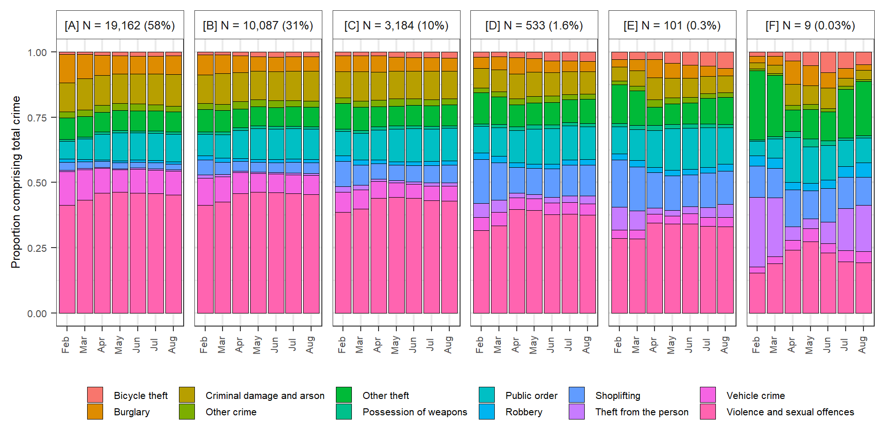

```{r setup, include=FALSE, echo = F}
knitr::opts_chunk$set(echo = FALSE)
library(readr);library(kableExtra)
```

## Introduction

- An evidence-base has begun to emerge around the impact of the COVID-19 pandemic on crime.
- Most studies have focused on macro-level units of analysis, such as cities or countries.
- Findings have tended to demonstrate a widespread decline in police-recorded crime.
- The longitudinal patterns observed are largely consistent with opportunity perspectives on crime.
- As such, we are beginning to garner a reasonable evidence-base around the impact of the pandemic lockdown on crime at the macro-level.
- That said, less is known about the localized drivers of the fall in police-recorded crime, and the degree of which areas have experienced the lockdown crime drop in unison.
- This challenge speaks to two strands of literature. Firstly, crime concentration research examining localized instability during crime drops [@andresen2017trajectories] and secondly, examinations of inequality in the exposure to crime in a drop scenario [@ignatans2016whom; @akmed2021mon; @mcvie2020increasing].
- Here, we disentangle the macro-level drop in police-recorded notifiable offences (excluding drugs) in England and Wales (see Langton et al., 2021) between February and August 2020, aggregating data to neighbourhood units (N = 33,075).
- We do this using non-parametric longitudinal clustering, which identifies areas which remained stable, even amidst nationwide volatility, and disentangles (small number of) the areas which drove the decline and subsequent resurgence.
- Findings are augmented with a breakdown of the facilities present in each cluster, using data sourced from Open Street Map, and the crime type profile of each cluster.
- Results are discussed in the context of geographic inequalities and opportunity theories of crime.

## Background

- Recent months have seen a wave of interest in describing and explaining changes in  police-recorded crime in response to restrictions on mobility brought about by efforts to limit the spread of COVID-19.
- Generally speaking, findings have been consistent with theoretical expectations from an opportunity perspective, namely, that lockdown restrictions disrupted the convergence of motivated offenders, (in)capable guardians and suitable targets, bringing about widespread, macro-level declines in crime.
- Some notable cases demonstrate that changes may be specific to crime type, although some studies using longer time periods have shown that change has been relatively uniform across crime types, with some exceptions (Langton et al., 2021).
- Findings hold important practical and theoretical value for crime science research, and yet, less is known about the localized drivers of macro-level trends. 
- Questions around the drivers of macro-level crime drops have been asked since the early 2000s, during which time much of the world experienced a considerably fall in crime [@weisburd2012criminology; @weisburd2004trajectories; @bannister2018local].
- Numerous studies have deployed longitudinal clustering methods to unmask localized variation in the crime drop. Findings have consistently found that macro-level declines in crime over many years (decades) tend to be driven by a disproportionately small number of places, with most areas remaining fairly stable.
- Here, we are presented with a unique scenario. Rather than a gradual decline in police-recorded crime over many decades, we have witnessed an overnight decline over a matter of months. And yet, comparable questions remain.
- To what extent have areas experienced this decline in unison? Have the dividends of the lockdown crime drop been shared equitably across space [@akmed2021mon]?
- Here, we use 7-months of police-recorded crime in England and Wales, aggregated to meso-level local units, to disentangle the nationwide lockdown crime drop.

## Data and Method

### Data

- Police-recorded crime data for England and Wales (excluding Greater Manchester) between February and August, covering the first six months of lockdown March to August, and the preceding month (February), for comparison.
- Data is available for thirteen notifiable offences, and anti-social behaviour (ASB).
- As demonstrated in Langton et al., 2021 most notifiable offences experienced dramatic declines during April, the first full month of lockdown nationwide. 
- Exceptions are drugs and ASB, which we exclude, and then aggregate to create a measure of 'total crime', representing all notifiable offences excluding drugs.
- On the local level, data is aggregated to Lower Super Output Area level, a neighborhood unit designed to be uniform by resident population (~ 1500 people), of which there are around 33,000 in England and Wales.
- Data on facilities to describe LSOAs are obtained from the Open Street Map API using the `osmdata` package [@osmrpack] in R [@rman].

### Method 
- We set the background with descriptive statistics on macro-level trends (raw counts) and concentration (generalized Gini coefficient) by crime type, including the total crime category.
- This provides the 'global' picture of raw change and concentration at the national level, setting the reference point from which we can unmask the local variability underpinning the macro-level change.
- For the main analysis, we deploy k-means, a non-parametric longitudinal clustering technique, on the notifiable offences measure, aggregated to LSOA in England and Wales.
- K-means has been used in crime concentration research to disentangle local variation from macro-level trends [@andresen2017trajectories; @curman2015crime].
- Its deployment was largely inspired by a popular technique, group-based trajectory modelling (GBTM) [@weisburd2004trajectories].
- K-means has a number of benefits over GBTM (detailed in @curman2015crime) but in this scenario, it has a unique advantage, in that it is highly capable of identifying short-term fluctuation, unlimited by polynomial terms [@akmed2021mon].
- In this way, it suitable for usage in this 'natural experiment' scenario, whereby we expect change to occur rapidly and dramatically from one month to the next, rather than smoothed over many years.
- Cluster solution is determined by the Calinski-Criterion [@calinski1974dendrite].

## Results

### Nationwide trends

- Raw counts of crime types and notifiable offences confirm what has been elsewhere and existing (more detailed) accounts of lockdown crime in England and Wales (Langton et al., 2021).

```{r crimeoverall, fig.pos = 'H', message=F, comment=F, warning=F, fig.cap = "Macro-level crime trends in England and Wales during the lockdown period in 2020."}
knitr::include_graphics("visuals/raw_counts_gg.png")
```

### Nationwide concentration

- Here, we note that most crime types experienced remarkably stable global concentration, even amidst dramatic volatility in crime counts.
- Exceptions include bicycle theft, theft from the person, other theft, robbery, and to some extent vehicle crime.
- These experienced a fall in concentration (i.e. crimes were less concentrated, and more spread out) compared to 2019.
- Overall, however, notifiable offences experienced minimal change, with these crime types driving a marginal dip in concentration during the first two months of lockdown, quickly returning to normal levels of concentration and crime surged back upwards during summer.

```{r crimegini, fig.pos = 'H', message=F, comment=F, warning=F, fig.cap = "Measure of concentration using the generalized Gini coefficient during the lockdown period."}

```

- Based on these raw counts and Gini concentration trends over time, we might expect localized variability in notifiable offences. 
- Have neighborhoods experienced these trends collectively and uniformly? Or have we attribute most of the macro-level trends to a handful of areas? To what extent have the dividends of the crime drop been shared equitably across the country [@akmed2021mon]?
- This is what we can answer and explore using k-means to cluster the longitudinal trajectories of LSOAs.

### Longitudinal clustering

#### Cluster trends

- General conclusion: most of the lockdown crime drop can be attributed to a small number LSOAs.
- Most localized areas actually experienced minimal crime change during the pandemic.
- The proportion of total crime attributable to very low and very high crime clusters fell into April, while mid-crime areas increased their proportion.
- All clusters converged back to 'normality' by the end of August.
- Remarkable stability given the absolute change that occurred during this study period.
- 2020 mean (dotted line) and median (solid line) of each cluster are shown in black.
- 2019 mean (dotted line) and median (solid line) of each cluster are shown in red.
- This demonstrates that the clusters identified using the 2020 data were distinct and meaningful even when also applied to the 2019 data.

```{r kmeansnotoff, fig.pos = 'H', message=F, comment=F, warning=F, fig.cap = "K-means cluster solutions for LSOA notifiable offences. Mean (dotted line) and median (solid line) are shown for each cluster for 2020 (black), 2019 (red) and 2018 (blue) respectively. Distributions refer to 2020 only.", out.width= "90%"}
knitr::include_graphics("visuals/kmeans_violin_k6_1819_gg.png")
```

#### Contribution of each cluster

```{r changeline, fig.pos = 'H', message=F, comment=F, warning=F, fig.cap = "Counts and percentage of nationwide change between months attributable to each cluster.", out.width= "100%"}

```

- The above summarises absolute counts and proportional month-on-month change attributable to each cluster.
- We use this to identify which clusters drove the initial decline and subsequent resurgence nationwide.
- Percentages represent the proportion of total nationwide month-on-month change attributable to each cluster.
- For example, the red cluster (N = 23,924), despite consisting of 72% of total LSOAs, only contributed to 32% of the drop in notifiable offences between March and April.
- While, the pink cluster (N = 83) despite comprising only 0.25% of LSOAs, contributed to 13% of the fall in notifiable offences between March and April.
- This 'high crime big drop' cluster would stabilise between April and May, contributing little to the initial nationwide increase -- rather, this change is due to the other clusters increasing and 'resurging' back to normality.
- Between July and August, red and green clusters would actually experience a drop in notifiable offences, accounting for 17% and 9% of total change respectively. This would partially offset the continued increase among the blue and pink clusters, which accounted for 46% and 28% of total change respectively.
- The macro-level outcome of this July to August change was a marginal increase in crime.
- The nationwide trend of 'decline and resurgence' masks underlying volatility: most of the initial 'lockdown crime drop' can be attributed to a disproportionately small number of areas, and the subsequent resurgence back to normality was not uniform, varying considerably at localised spatial scales.

### Spatial distribution of clusters

- List major city composition?
- Maps of major city case studies.
- Link to interactive map.

### Characteristics of clusters

Descriptive statistics about the LSOAs in each cluster solution.

```{r thresht, warning=F, message = F}
osm_stats_df <- read_csv("data/osm_stats_sub_rounded_k6.csv")

osm_table <- kable(osm_stats_df, caption = "Descriptive statistics of facilities in each cluster. Sourced from Open Street Map.",
      booktabs = T, longtable = T, linesep = "", format = "latex") %>%
    kable_styling(latex_options = c("basic"),
                  font_size = 8, full_width = F)

column_spec(osm_table, c(1:9), width = c("0.7cm", "1.5cm", "1.5cm", "1.5cm", "1.5cm", "1cm", "1cm", "1.5cm", "1cm"))
```

#### Crime type profile

- What crime types tend to comprise each cluster?

```{r crimeprofile, fig.pos = 'H', message=F, comment=F, warning=F, fig.cap = "Crime type characteristics of each cluster solution.", out.width= "90%"}

```

## Discussion

## Appendix
